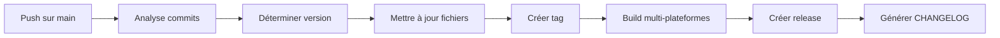

# 📋 Résumé du Workflow de Release

## 🎯 Objectif

Créer un workflow de release entièrement automatisé avec gestion de version sémantique pour Lumina Portfolio.

## ✅ Composants Créés

### 1. Workflow Principal

**Fichier** : `.github/workflows/release.yml`

- Analyse automatique des commits (Conventional Commits)
- Détermination du type de version (major/minor/patch/prerelease)
- Mise à jour automatique des versions (`package.json`, `Cargo.toml`)
- Création de tags Git et releases GitHub
- Build multi-plateformes (macOS, Linux, Windows)
- Génération de CHANGELOG

### 2. Workflow de Validation

**Fichier** : `.github/workflows/release-check.yml`

- Validation des PRs avant merge
- Analyse des commits et prédiction de version
- Vérification de la cohérence des versions
- Tests automatisés
- Commentaires automatiques sur les PRs

### 3. Configuration Commits

**Fichier** : `.commitlintrc.js`

- Configuration des Conventional Commits
- Types valides : feat, fix, docs, style, refactor, perf, test, chore, build, ci, revert
- Scopes valides : ui, api, library, tags, collections, search, settings, etc.

### 4. Hooks Git

**Fichiers** : `.husky/pre-commit`, `.husky/commit-msg`

- Validation des messages de commits
- Exécution des tests avant chaque commit
- Intégration avec commitlint

### 5. Documentation

**Fichiers** :

- `docs/SEMANTIC_RELEASE_GUIDE.md` : Guide complet d'utilisation
- `docs/RELEASE_WORKFLOW_SUMMARY.md` : Ce résumé
- `README.md` : Section ajoutée sur le workflow

## 🔄 Fonctionnement

### Déclenchement Automatique



### Types de Versions

| Type de Commit     | Version    | Exemple              |
| ------------------ | ---------- | -------------------- |
| `feat:`            | Minor      | 0.3.0 → 0.4.0        |
| `fix:`             | Patch      | 0.3.0 → 0.3.1        |
| `BREAKING CHANGE:` | Major      | 0.3.0 → 1.0.0        |
| Branche develop    | Prerelease | 0.3.0 → 0.3.1-beta.1 |

## 📦 Résultats

### Fichiers Modifiés

- `package.json` : Version frontend mise à jour
- `src-tauri/Cargo.toml` : Version backend mise à jour
- `CHANGELOG.md` : Historique généré automatiquement

### Artefacts Créés

- Tag Git : `vX.Y.Z`
- Release GitHub : Notes + assets
- Builds : `.dmg`, `.AppImage`, `.msi`

## 🎛️ Contrôle Manuel

### Déclenchement via GitHub UI

1. Actions → Semantic Release
2. "Run workflow"
3. Choisir type de version
4. Spécifier tag de pré-release (optionnel)

### Options Disponibles

- `patch` : Correction de bugs
- `minor` : Nouvelles fonctionnalités
- `major` : Changements cassants
- `prerelease` : Versions de test

## 🛡️ Sécurité et Validation

### Checks Automatiques

- ✅ Tests passent
- ✅ Type check réussi
- ✅ Build successful
- ✅ Commits conventionnels valides
- ✅ Versions cohérentes
- ✅ Scan de sécurité

### Prévention des Erreurs

- Validation des messages de commits
- Vérification des versions avant release
- Tests complets avant merge
- Analyse des changements cassants

## 📊 Monitoring

### Résumé de Release

Chaque release génère un résumé dans GitHub Actions avec :

- Version créée
- Type de release
- Statut des builds
- Liens vers les assets

### Notifications

- Commentaires sur PRs avec analyse des changements
- Résumé automatique dans GitHub Actions
- Logs détaillés pour debugging

## 🚀 Avantages

### Automatisation Complète

- Plus de manipulation manuelle des versions
- Release cohérentes et traçables
- Historique complet des changements

### Qualité Améliorée

- Commits structurés et descriptifs
- Validation automatique des changements
- Documentation générée automatiquement

### Développement Accéléré

- Focus sur le code, pas sur la release
- Feedback rapide sur les PRs
- Processus prévisible et fiable

## 🔄 Migration

### Avant

- Release manuelle via GitHub UI
- Version mise à jour manuellement
- Builds séparés par plateforme
- Documentation manuelle

### Après

- Release entièrement automatisée
- Version sémantique automatique
- Builds multi-plateformes simultanés
- Documentation générée automatiquement

## 📚 Ressources

### Documentation

- [Guide Semantic Release](./SEMANTIC_RELEASE_GUIDE.md)
- [Conventional Commits](https://www.conventionalcommits.org/)
- [GitHub Actions](https://docs.github.com/en/actions)

### Commandes Utiles

```bash
# Vérifier la configuration
npm run commitlint

# Tester le workflow localement
act -j semantic-release

# Forcer une version
npm version 1.2.3 --no-git-tag-version
```

## 🎯 Prochaines Étapes

1. **Intégration Slack** : Notifications de releases
2. **Rollback automatique** : En cas d'échec critique
3. **Release notes IA** : Génération améliorée des notes
4. **Tests E2E** : Intégration dans le workflow

---

_Ce workflow est maintenant opérationnel et prêt à être utilisé pour toutes les futures releases de Lumina Portfolio._
