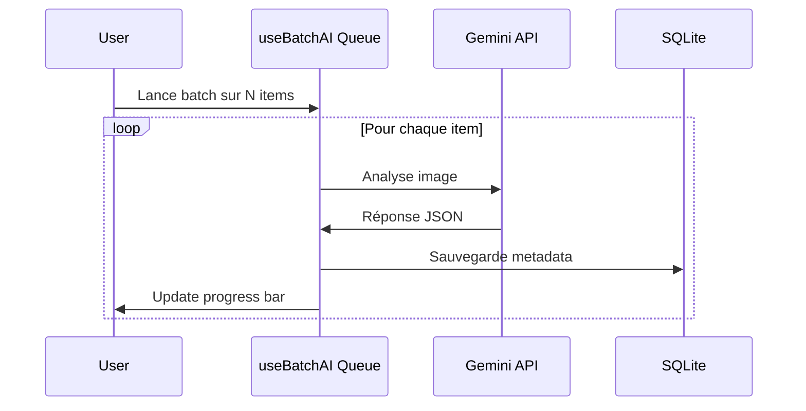

# Intégration AI (Gemini)

L'application utilise le SDK `@google/genai` pour analyser les images et enrichir les métadonnées.

## Configuration

Le service est isolé dans `services/geminiService.ts`.

| Paramètre | Valeur |
|-----------|--------|
| **Modèle** | `gemini-3-flash-preview` (Strictement imposé) |
| **Format réponse** | JSON structuré |
| **Authentification** | Clé API via `localStorage` ou variable d'environnement |

> [!IMPORTANT]
> L'utilisation du modèle **`gemini-3-flash-preview`** est obligatoire. Tout downgrade est interdit par règle projet.

## Gestion de la Clé API

L'ordre de priorité pour récupérer la clé :

```typescript
// 1. localStorage (utilisateur)
const storedKey = localStorage.getItem("gemini_api_key");

// 2. Variable d'environnement Vite
import.meta.env.VITE_GEMINI_API_KEY

// 3. Fallback process.env (legacy)
process.env.GEMINI_API_KEY
```

> [!TIP]
> En tant qu'application native Tauri, il n'y a **aucune restriction CORS** pour les appels API vers Google. Les requêtes s'exécutent directement sans proxy.

---

## Workflow d'Analyse (Image Unique)

1. **Encodage** : L'image (File object ou path Tauri) est convertie en chaîne Base64.

2. **Prompt Engineering** :
   ```typescript
   text: `Analyze this image. 
          1. Provide a concise description (max 2 sentences).
          2. List 5-8 relevant tags.
          3. List technical details/movements if applicable.
          
          Return valid JSON only matching this structure:
          {
            "description": "string",
            "tags": [ {"name": "string", "confidence": 0.0-1.0} ]
          }`
   ```

3. **Parsing** : La réponse JSON est parsée et typée en `AiTagDetailed[]`.

4. **Persistance** : Les résultats sont sauvegardés dans SQLite via `storageService.saveMetadata()`.

---

## Batch Processing (Traitement par Lots)

Pour analyser de grands dossiers sans intervention manuelle répétée :



### Avantages

- Évite de spammer l'API et de déclencher des erreurs "Rate Limit" (429).
- Ne bloque pas l'interface utilisateur (l'utilisateur peut naviguer pendant l'analyse).
- Indicateur de progression visuel dans la `TopBar`.

---

## Gestion des Erreurs

| Erreur | Comportement |
|--------|--------------|
| Clé API manquante | Erreur explicite → Ouvrir Settings |
| JSON malformé | Fallback avec description vide |
| Erreur réseau | Log erreur, continue batch |
| Rate limit (429) | Pause automatique, retry |

---

## Limites

- L'image est envoyée aux serveurs de Google, ce qui nécessite une connexion internet.
- Les fichiers très volumineux (>20MB) peuvent nécessiter un redimensionnement préalable avant l'envoi en Base64.
- Le modèle `gemini-3-flash-preview` est un modèle preview et peut évoluer.