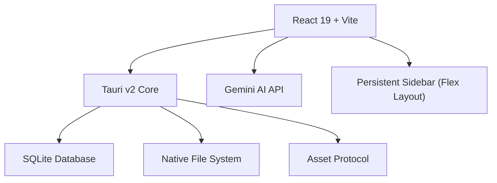
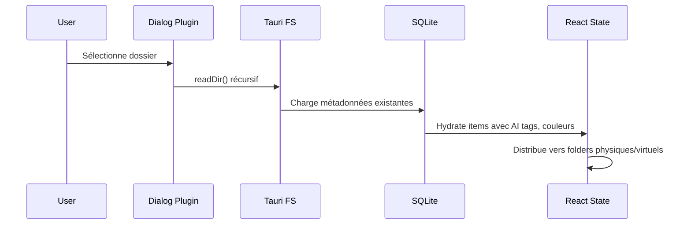

# Architecture Technique - Lumina Portfolio V2

Dernière mise à jour : 24/12/2024 à 22:00

## Vue d'Ensemble

Lumina Portfolio est une application native **Local-First** construite avec **Tauri v2**, offrant une expérience desktop haute performance sans backend externe.



## Système de Sidebar (Pinned vs Float)

L'application utilise un système de navigation hybride pour la bibliothèque :

- **Mode Float (Drawer)** : La barre latérale s'affiche en superposition (overlay) avec un backdrop flou. Idéal pour les petits écrans ou une consultation rapide.
- **Mode Pinned (Persistant)** : La barre latérale est fixée à gauche et **pousse** le contenu principal (galerie).

### Implémentation du Layout

Le layout racine (`App.tsx`) utilise une structure `flex-row` dynamique :
- **Conteneur Principal** : `h-screen overflow-hidden flex flex-col`
- **Body** : `flex-1 flex flex-row overflow-hidden`
- **Sidebar** : `w-80 shrink-0` (en mode pinned)
- **Galerie** : `flex-1 overflow-y-auto`

Cette structure garantit que la galerie et la sidebar possèdent des zones de défilement **indépendantes**, empêchant le défilement de l'un d'affecter l'autre.

## Stack Technologique

| Layer              | Technologie                       | Rôle                           |
| ------------------ | --------------------------------- | ------------------------------ |
| **Frontend**       | React 19 + Tailwind CSS v4        | Interface utilisateur          |
| **Runtime**        | Tauri v2                          | Bridge natif, sécurité, bundle |
| **Persistance**    | SQLite (`@tauri-apps/plugin-sql`) | Base de données locale         |
| **Fichiers**       | `@tauri-apps/plugin-fs`           | Accès système de fichiers      |
| **UI Native**      | `@tauri-apps/plugin-dialog`       | Sélecteur de dossiers natif    |
| **Virtualisation** | `@tanstack/react-virtual` 3.13    | Rendu UI optimisé              |

---

## Architecture de Code (Feature-Based)

Le projet suit une architecture **fractal modulaire** pour maximiser la maintenabilité.

```
src/
  ├── features/           # Domaines fonctionnels
  │   ├── library/        # Grille photos, cartes, carrousels (standard & 3D)
  │   ├── navigation/     # TopBar, Library navigation (Layers icon)
  │   ├── collections/    # Gestionnaire dossiers, Projets
  │   ├── vision/         # AI Analysis, ImageViewer
  │   └── tags/           # Système de tagging
├── shared/             # Ressources transverses
│   ├── components/     # UI Kit (Button, Modal, GlassCard)
│   ├── hooks/          # Hooks réutilisables
│   ├── types/          # Types globaux (PortfolioItem)
│   ├── utils/          # Fonctions utilitaires
│   └── theme/          # Design Tokens
├── contexts/           # État global optimisé
│   ├── CollectionsContext.tsx
│   ├── LibraryContext.tsx    # Split en State/Dispatch
│   ├── SelectionContext.tsx
│   └── ProgressContext.tsx
├── services/           # Logique métier externe
│   ├── geminiService.ts
│   ├── libraryLoader.ts
│   └── storageService.ts
└── App.tsx             # Point d'entrée, composition
```

---

## État Global (Contexts Optimisés)

### Pattern "Context Split" (Performance)

Pour éviter les re-rendus globaux, `LibraryContext` est séparé en deux :

```typescript
// Contexte READ-ONLY (données)
const LibraryStateContext = createContext<LibraryContextState>();

// Contexte WRITE-ONLY (actions)
const LibraryDispatchContext = createContext<LibraryContextActions>();

// Hooks ciblés
export const useLibraryState = () => useContext(LibraryStateContext);
export const useLibraryActions = () => useContext(LibraryDispatchContext);

// Hook legacy (API compatible)
export const useLibrary = () => ({
	...useLibraryState(),
	...useLibraryActions(),
});
```

**Avantage** : Un composant utilisant uniquement `useLibraryActions()` ne se re-rend PAS lors des changements de données.

### Autres Contexts

| Contexte               | Responsabilité                             |
| ---------------------- | ------------------------------------------ |
| **CollectionsContext** | Gestion des workspaces multi-bibliothèques |
| **SelectionContext**   | Sélection multiple, drag-select            |
| **ProgressContext**    | Indicateurs de progression asynchrones     |

---

## Approche "Local-First" & Persistance

### 1. Projets et Shadow Folders

L'application organise les fichiers via des "Projets" isolés :

- **Projet** = Workspace indépendant (anciennement "Collection")
- Chaque projet possède ses propres :
  - **Dossiers sources** (liens vers disque, lecture seule)
  - **Shadow folders** (clones virtuels auto-créés, modifiables)
  - **Manual Collections** (albums logiques créés par l'utilisateur, cibles exclusives de déplacement)
  - **Métadonnées** (tags AI, couleurs)

#### Shadow Folders (Architecture Non-Destructive)

Pour chaque dossier source ajouté, un **shadow folder** est automatiquement créé. Ce dossier virtuel :

- Contient les mêmes items que le dossier source
- Permet des modifications **non-destructives** (tags, déplacement vers collections)
- N'affecte jamais les fichiers sources originaux
- Est visible dans la section "Dossiers de Travail" du FolderDrawer

```
Dossier Source (/Photos/Vacances) [lecture seule]
    ↓ auto-création
Shadow Folder "Vacances" [modifiable]
    → Contient copies virtuelles des items
    → Modifications isolées
```

### 2. Base de Données Locale (SQLite)

SQLite via `@tauri-apps/plugin-sql` avec **4 tables** :

```sql
-- Collections (workspaces)
CREATE TABLE collections (
  id TEXT PRIMARY KEY,
  name TEXT NOT NULL,
  createdAt INTEGER NOT NULL,
  lastOpenedAt INTEGER,
  isActive INTEGER DEFAULT 0
);

-- Dossiers sources (physiques)
CREATE TABLE collection_folders (
  id TEXT PRIMARY KEY,
  collectionId TEXT NOT NULL,
  path TEXT NOT NULL,
  name TEXT NOT NULL,
  addedAt INTEGER NOT NULL,
  FOREIGN KEY (collectionId) REFERENCES collections(id) ON DELETE CASCADE
);

-- Dossiers virtuels (albums + shadow folders)
CREATE TABLE virtual_folders (
  id TEXT PRIMARY KEY,
  collectionId TEXT NOT NULL,
  name TEXT NOT NULL,
  createdAt INTEGER NOT NULL,
  isVirtual INTEGER DEFAULT 1,
  sourceFolderId TEXT,  -- NEW: Lien vers source (shadow folders uniquement)
  FOREIGN KEY (collectionId) REFERENCES collections(id) ON DELETE CASCADE
);

-- Métadonnées enrichies
CREATE TABLE metadata (
  id TEXT PRIMARY KEY,
  collectionId TEXT,
  virtualFolderId TEXT,
  aiDescription TEXT,
  aiTags TEXT,           -- JSON array
  aiTagsDetailed TEXT,   -- JSON avec confidence
  colorTag TEXT,
  manualTags TEXT,       -- JSON array
  lastModified INTEGER NOT NULL,
  FOREIGN KEY (collectionId) REFERENCES collections(id) ON DELETE SET NULL
);
```

### 3. Asset Protocol (Tauri)

Tauri fournit un protocol sécurisé pour accéder aux images locales :

```typescript
import { convertFileSrc } from "@tauri-apps/api/core";

// Transforme un chemin absolu en URL asset://
const assetUrl = convertFileSrc("/Users/john/Photos/image.jpg");
// → "asset://localhost/Users/john/Photos/image.jpg"
```

**Configuration dans `tauri.conf.json`** :

```json
"security": {
  "assetProtocol": {
    "enable": true,
    "scope": ["$HOME/**"]
  }
}
```

---

## Optimisation des Performances

### Virtualisation UI (@tanstack/react-virtual)

Le rendu de milliers d'éléments DOM est résolu par la virtualisation :

- **Stratégie** : Virtual Masonry avec `@tanstack/react-virtual`
- **Implémentation** :
  - Calcul des positions absolues via AspectRatio
  - Distribution en colonnes (Masonry)
  - Rendu uniquement des items visibles (+buffer)
  - Auto-Scroll intelligent lors de la navigation clavier

```typescript
// PhotoGrid - Distribution Masonry
const cols = useMemo(() => {
	const columns: PortfolioItem[][] = Array.from(
		{ length: gridColumns },
		() => []
	);
	items.forEach((item, index) => {
		const colIndex = index % gridColumns;
		const targetColumn = columns[colIndex];
		if (targetColumn) targetColumn.push(item);
	});
	return columns;
}, [items, gridColumns]);

// Virtualizer par colonne
const rowVirtualizer = useVirtualizer({
	count: colItems.length,
	getScrollElement: () => containerRef.current,
	estimateSize: (i) => {
		const item = colItems[i];
		if (item.width && item.height && columnWidth > 0) {
			return columnWidth / (item.width / item.height) + GAP;
		}
		return 300 + GAP;
	},
	overscan: 5,
});
```

### React.memo & Lazy Loading

```typescript
// PhotoCard optimisé
const PhotoCardComponent: React.FC<PhotoCardProps> = ({ item, isSelected, ... }) => {
  const [isLoaded, setIsLoaded] = useState(false);

  return (
    <>
      {!isLoaded && <div className="animate-pulse bg-white/5" />}
      <motion.img
        src={item.url}
        onLoad={() => setIsLoaded(true)}
        initial={{ opacity: 0 }}
        animate={{ opacity: isLoaded ? 1 : 0 }}
      />
    </>
  );
};

// Memoization avec comparaison custom
export const PhotoCard = React.memo(PhotoCardComponent, (prev, next) => {
  return (
    prev.item === next.item &&
    prev.isSelected === next.isSelected &&
    prev.isFocused === next.isFocused
    // Ignore les fonctions (onSelect, etc.)
  );
});
```

### Code Splitting (Vite)

```typescript
// vite.config.ts
manualChunks(id) {
  if (id.includes("framer-motion")) return "vendor-framer";
  if (id.includes("lucide-react")) return "vendor-lucide";
  if (id.includes("react")) return "vendor-react";
  return "vendor";
}
```

---

## Flux de Données (Chargement & Fusion)



### Chargement des Dossiers Sources

1. **Scan Disque** : `readDir()` récursif via `@tauri-apps/plugin-fs`
2. **Chargement DB** : Récupération des métadonnées et dossiers virtuels
3. **Hydratation** :
   - Chaque fichier est enrichi avec ses métadonnées (tags AI, couleurs)
   - Si `virtualFolderId` existe, l'item est déplacé dans le dossier virtuel
4. **Rendu** : État `folders` unifié (physiques + virtuels)

### Chargement des Collections Virtuelles (Startup)

Au démarrage de l'application ou lors du changement de projet actif, `LibraryContext` charge automatiquement les collections virtuelles créées par l'utilisateur :

```typescript
// LibraryContext.tsx - useEffect
useEffect(() => {
  const loadVirtualFolders = async () => {
    if (!activeCollection) return;

    const storedVirtual = await storageService.getVirtualFolders(activeCollection.id);

    // Filtre pour exclure les shadow folders (avec sourceFolderId)
    const userCollections = storedVirtual.filter((vf) => !vf.sourceFolderId);

    if (userCollections.length > 0) {
      dispatch({ type: "SET_FOLDERS", payload: userCollections });
    }
  };

  loadVirtualFolders();
}, [activeCollection?.id]);
```

**Différenciation des types de dossiers** :
- **Shadow folders** : `isVirtual=true` + `sourceFolderId` présent → Chargés par `loadFromPath`
- **Collections virtuelles** : `isVirtual=true` + `sourceFolderId` absent → Chargées au startup
- **Dossiers sources** : `isVirtual=false` → Scannés depuis le disque

---

## Déploiement Tauri

### Build Commands

```bash
# Développement
npm run tauri:dev      # Frontend + Backend simultanés

# Production
npm run tauri:build    # Génère .dmg / .app pour macOS
```

### Capabilities & Permissions

Les permissions sont définies dans `src-tauri/capabilities/default.json` :

| Permission           | Scope      | Description          |
| -------------------- | ---------- | -------------------- |
| `fs:allow-read-dir`  | `$HOME/**` | Lecture des dossiers |
| `fs:allow-read-file` | `$HOME/**` | Lecture des fichiers |
| `sql:allow-*`        | Local DB   | Opérations SQLite    |
| `dialog:default`     | System     | Dialogs natifs       |

### GitHub Actions CI/CD

Le workflow `.github/workflows/release-macos.yml` :

- Trigger : Push sur `main` ou dispatch manuel
- Génère un draft release avec `.dmg` attaché
- Version automatique depuis `tauri.conf.json`

---

## Stratégie de Tests

L'application utilise **Vitest** pour garantir la fiabilité du cœur logique.

### Structure

- **`tests/`** : Dossier racine contenant tous les tests (Vitest)
  - `useKeyboardShortcuts.test.ts` : Navigation, sélection, colors
  - `useItemActions.test.ts` : Actions métier, analyse AI, dossiers
  - `geminiService.test.ts` : Mock le SDK Google GenAI
  - `fileHelpers.test.ts` : Mock Tauri FS (scan récursif)
  - `ErrorBoundary.test.tsx` : Tests de rendu et repli UI

### Exécution

```bash
npm run test
```

- **Environnement** : `jsdom` (simulation DOM pour hooks et composants)
- **Mocks** : `@tauri-apps/plugin-fs`, `@tauri-apps/api/core`, `@google/genai`
- **Couverture** : Couverture complète du cœur logique (hooks extraits) et des services critiques.
## Optimisations de Performance

### État Actuel (Décembre 2024)

L'application utilise déjà plusieurs optimisations clés :

#### ✅ Virtualisation (TanStack Virtual)
- **PhotoGrid** : Rendu virtuel par colonnes avec calcul dynamique des hauteurs
- **Overscan** : 10 éléments pré-rendus pour scrolling fluide
- **Impact** : Seules ~30 images visibles sont rendues simultanément

#### ✅ Context Splitting
- `LibraryContext` séparé en état/dispatch pour minimiser les re-renders
- `useMemo` pour `processedItems` et `availableTags`

#### ✅ Batch Updates Atomiques
- Action `BATCH_UPDATE_ITEMS` pour mises à jour groupées
- Élimine les race conditions lors de modifications multiples

### Problèmes Identifiés (Audit 24/12/2024)

#### 🔴 Critique
1. **Pas de système de thumbnails** → Images en pleine résolution (5MB chacune)
2. **PhotoCarousel : 5 images simultanées** → Toutes en haute résolution
3. **Pas de lazy loading natif** → Temps de chargement initial très long

#### 🟡 Moyen
4. **Pas de cache LRU** → Rechargement constant
5. **Métadonnées toutes en RAM** → 50MB pour 10k images
6. **Re-renders excessifs** → Lag lors de changements d'état

### Plan d'Optimisation (3 Phases)

**Phase 1 : Quick Wins** → Lazy loading + overscan + déchargement carousel  
**Phase 2 : Thumbnails** → Service Rust + WebP (400px, 800px, 1200px)  
**Phase 3 : Avancé** → Cache LRU + Web Workers + IndexedDB

### Gains Estimés (1000 images)

| Métrique | Avant | Après | Amélioration |
|----------|-------|-------|--------------|
| Temps de chargement | 30s | 3s | -90% |
| Mémoire | 5GB | 500MB | -90% |
| FPS (scrolling) | 20fps | 60fps | +200% |

---

