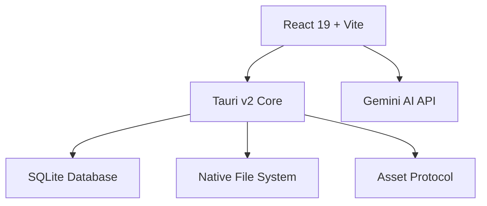
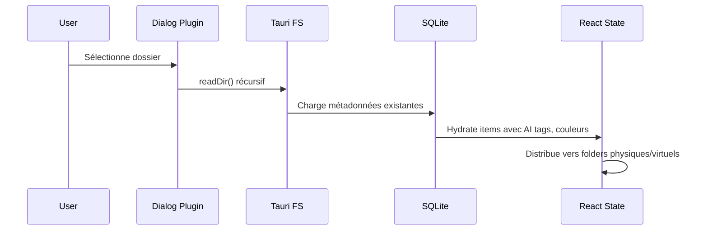

# Architecture Technique

## Vue d'Ensemble

Lumina Portfolio est une application native **Local-First** construite avec **Tauri v2**, offrant une expérience desktop haute performance sans backend externe.



## Stack Technologique

| Layer | Technologie | Rôle |
|-------|-------------|------|
| **Frontend** | React 19 + Tailwind CSS v4 | Interface utilisateur |
| **Runtime** | Tauri v2 | Bridge natif, sécurité, bundle |
| **Persistance** | SQLite (`@tauri-apps/plugin-sql`) | Base de données locale |
| **Fichiers** | `@tauri-apps/plugin-fs` | Accès système de fichiers |
| **UI Native** | `@tauri-apps/plugin-dialog` | Sélecteur de dossiers natif |

---

## Approche "Local-First" & Persistance

### 1. Système de Fichiers Hybride

L'application gère deux types de sources de données unifiées dans l'interface :

1. **Dossiers Physiques (Physical Folders)** : 
   - Provenance : Disque dur local via `@tauri-apps/plugin-fs`.
   - Accès : `readDir()`, `stat()` pour scanner les fichiers.
   - URLs : Transformées via `convertFileSrc()` → protocol `asset://`.
   - Persistance : Le chemin absolu est stocké en base SQLite.
    
2. **Dossiers Virtuels (Collections)** :
   - Provenance : Création interne à l'application.
   - Comportement : Structure purement logique stockée en base de données.
   - Persistance : La définition du dossier est stockée dans SQLite.

### 2. Base de Données Locale (SQLite)

Nous utilisons `@tauri-apps/plugin-sql` avec une base SQLite pour stocker **trois** tables :

```sql
-- Table: handles (références aux dossiers scannés)
CREATE TABLE handles (
  id TEXT PRIMARY KEY,
  path TEXT NOT NULL,
  timestamp INTEGER NOT NULL,
  isRoot INTEGER DEFAULT 0
);

-- Table: metadata (enrichissements AI, tags, couleurs)
CREATE TABLE metadata (
  id TEXT PRIMARY KEY,
  aiDescription TEXT,
  aiTags TEXT,           -- JSON array
  aiTagsDetailed TEXT,   -- JSON array with confidence
  colorTag TEXT,
  manualTags TEXT,       -- JSON array
  folderId TEXT,
  lastModified INTEGER NOT NULL
);

-- Table: virtual_folders (collections créées par l'utilisateur)
CREATE TABLE virtual_folders (
  id TEXT PRIMARY KEY,
  name TEXT NOT NULL,
  createdAt INTEGER NOT NULL,
  isVirtual INTEGER DEFAULT 1
);
```

### 3. Asset Protocol

Tauri fournit un protocol sécurisé pour accéder aux images locales :

```typescript
import { convertFileSrc } from "@tauri-apps/api/core";

// Transforme un chemin absolu en URL asset://
const assetUrl = convertFileSrc("/Users/john/Photos/image.jpg");
// → "asset://localhost/Users/john/Photos/image.jpg"
```

**Configuration dans `tauri.conf.json`** :
```json
"security": {
  "assetProtocol": {
    "enable": true,
    "scope": ["$HOME/**"]
  }
}
```

---

## Optimisation des Performances

### Virtualisation & Infinite Scroll

Le rendu de milliers d'éléments DOM (`div`, `img`) est le goulot d'étranglement principal.

- **Stratégie** : "Infinite Scroll" dans `PhotoGrid`.
- **Implémentation** : 
  - On ne rend initialement que les 20-30 premiers items.
  - Un "Sentinel" (div invisible) en bas de page est observé via `IntersectionObserver`.
  - Lorsqu'il devient visible, on charge le chunk suivant d'images.
  - Cela maintient le DOM léger et le défilement fluide (60fps).

### Code Splitting (Vite)

```typescript
// vite.config.ts
manualChunks(id) {
  if (id.includes("framer-motion")) return "vendor-framer";
  if (id.includes("lucide-react")) return "vendor-lucide";
  if (id.includes("react")) return "vendor-react";
  return "vendor";
}
```

---

## Flux de Données (Chargement & Fusion)



1. **Scan Disque** : Lecture récursive via `readDir()` → Génération d'une liste de fichiers bruts.
2. **Chargement DB** : Récupération des dossiers virtuels et des métadonnées depuis SQLite.
3. **Hydratation & Distribution** : 
   - Pour chaque fichier scanné, on vérifie s'il possède un `folderId` stocké dans ses métadonnées.
   - Si oui, il est déplacé dans le dossier virtuel correspondant.
   - Sinon, il reste dans son dossier physique d'origine.
4. **Rendu** : L'état `folders` final est une fusion des dossiers physiques restants et des dossiers virtuels peuplés.

---

## Déploiement Tauri

### Build Commands

```bash
# Développement
npm run tauri:dev      # Frontend + Backend simultanés

# Production
npm run tauri:build    # Génère .dmg / .app pour macOS
```

### Capabilities & Permissions

Les permissions sont définies dans `src-tauri/capabilities/default.json` :

| Permission | Scope | Description |
|------------|-------|-------------|
| `fs:allow-read-dir` | `$HOME/**` | Lecture des dossiers |
| `fs:allow-read-file` | `$HOME/**` | Lecture des fichiers |
| `sql:allow-*` | Local DB | Opérations SQLite |
| `dialog:default` | System | Dialogs natifs |

### GitHub Actions CI/CD

Le workflow `.github/workflows/release-macos.yml` :
- Trigger : Push sur `main` ou dispatch manuel
- Génère un draft release avec `.dmg` attaché
- Version automatique depuis `tauri.conf.json`

---

## Stratégie de Tests

L'application utilise **Vitest** pour garantir la fiabilité du cœur logique.

### Structure

- **`tests/`** : Dossier racine contenant tous les tests unitaires.
  - `geminiService.test.ts` : Mock le SDK Google GenAI pour vérifier les appels et l'utilisation stricte du modèle `gemini-3-flash-preview`.
  - `fileHelpers.test.ts` : Mock Tauri FS pour vérifier la récursivité du scan de fichiers et la détection des types MIME.

### Exécution

```bash
npm run test
```

- Environnement : `jsdom` (simulation DOM pour les composants React).
- Mocks : `@tauri-apps/plugin-fs`, `@tauri-apps/api/core` mockés pour tests unitaires.