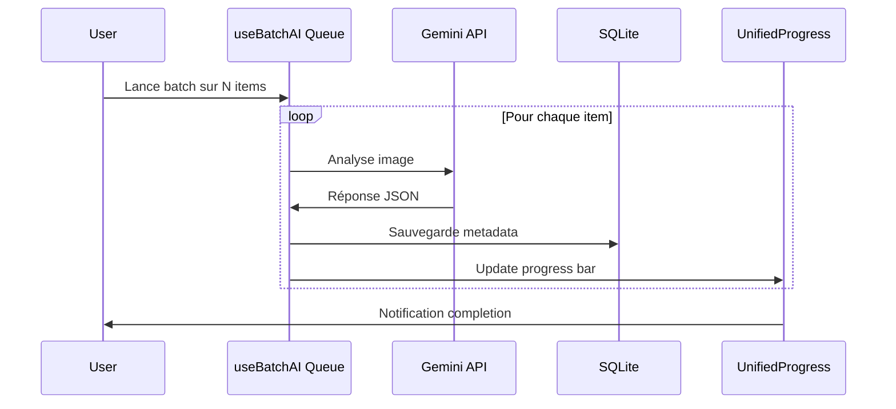

# Intégration AI (Gemini)

Dernière mise à jour : 02/01/2026 à 01:10

L'application utilise le SDK `@google/genai` pour analyser les images et enrichir les métadonnées.

## Configuration

Le service est isolé dans `src/features/vision/services/geminiService.ts`.

| Paramètre            | Valeur                                                 |
| -------------------- | ------------------------------------------------------ |
| **Modèle**           | `gemini-3-flash-preview` (Strictement imposé)          |
| **Format réponse**   | JSON structuré                                         |
| **Streaming**        | Supporté (pour Thinking Process)                       |
| **Authentification** | Clé API via `localStorage` ou variable d'environnement |

> [!IMPORTANT]
> L'utilisation du modèle **`gemini-3-flash-preview`** est obligatoire. Tout downgrade est interdit par règle projet.

## Gestion de la Clé API

L'ordre de priorité pour récupérer la clé (avec stockage sécurisé) :

```typescript
const getApiKey = async (): Promise<string> => {
	// 1. Stockage sécurisé (App Data DB/File) - Recommandé
	const secureKey = await secureStorage.getApiKey();
	if (secureKey) return secureKey;

	// 2. localStorage (Legacy/Dev uniquement)
	const storedKey = localStorage.getItem("gemini_api_key");
	if (storedKey) return storedKey;

	// 3. Variable d'environnement Vite
	if (import.meta.env?.VITE_GEMINI_API_KEY) {
		return import.meta.env.VITE_GEMINI_API_KEY;
	}

	// 4. Fallback process.env (legacy/shim)
	if (process.env.GEMINI_API_KEY) {
		return process.env.GEMINI_API_KEY;
	}

	throw new ApiKeyError();
};
```

> [!NOTE]
> L'application utilise maintenant `secureStorage` (via `src/services/secureStorage.ts`) pour stocker les clés API de manière sécurisée, au lieu de localStorage. Ceci améliore la sécurité en isolant les données sensibles.

> [!TIP]
> En tant qu'application native Tauri, il n'y a **aucune restriction CORS** pour les appels API vers Google. Les requêtes s'exécutent directement sans proxy.

---

## Workflow d'Analyse

### 1. Analyse Simple (Mode Rapide)

Pour une analyse d'image unique sans "Thinking Process" :

```typescript
export const analyzeImage = async (
	item: PortfolioItem
): Promise<{
	description: string;
	tags: string[];
	tagsDetailed: AiTagDetailed[];
}> => {
	const apiKey = getApiKey();
	const ai = new GoogleGenAI({ apiKey });

	// 1. Conversion Base64
	let base64Data = "";
	if (item.file) {
		base64Data = await processFileToBase64(item.file);
	} else if (item.url) {
		// Fallback: Fetch depuis asset://
		const response = await fetch(item.url);
		const blob = await response.blob();
		const file = new File([blob], item.name, { type: item.type });
		base64Data = await processFileToBase64(file);
	}

	// 2. Appel API
	const response = await ai.models.generateContent({
		model: "gemini-3-flash-preview",
		contents: [
			{
				role: "user",
				parts: [
					{ inlineData: { mimeType: item.type, data: base64Data } },
					{
						text: `Analyze this image.
                 1. Provide a concise description (max 2 sentences).
                 2. List 5-8 relevant tags.

                 Return valid JSON only matching this structure:
                 {
                   "description": "string",
                   "tags": [ {"name": "string", "confidence": 0.0-1.0} ]
                 }`,
					},
				],
			},
		],
		config: {
			responseMimeType: "application/json",
		},
	});

	// 3. Parsing & Normalisation
	const json = JSON.parse(response.text);
	const tagsDetailed: AiTagDetailed[] = (json.tags || []).map((t: any) => ({
		name: t.name || String(t),
		confidence: typeof t.confidence === "number" ? t.confidence : 1.0,
	}));

	return {
		description: json.description || "No description generated.",
		tags: tagsDetailed.map((t) => t.name),
		tagsDetailed,
	};
};
```

### 2. Analyse avec Thinking Process (Mode Stream)

Pour visualiser le raisonnement de l'AI en temps réel :

````typescript
export const analyzeImageStream = async (
	item: PortfolioItem,
	onThinking: (text: string) => void,
	enableThinking: boolean = false
): Promise<{
	description: string;
	tags: string[];
	tagsDetailed: AiTagDetailed[];
}> => {
	const apiKey = getApiKey();
	const ai = new GoogleGenAI({ apiKey });

	// Conversion Base64 (identique)
	let base64Data = await processFileToBase64(
		item.file || (await fetchAsBlob(item.url))
	);

	// Prompt avec instruction "Thinking"
	let prompt = `Analyze this image.
    STEP 1: THINKING PROCESS
    Analyze the image composition, style, lighting, and subject matter step-by-step.
    Explain your reasoning for choosing specific tags.

    STEP 2: FINAL OUTPUT
    After your analysis, output the separator "---JSON---" and then the final JSON object.

    Structure:
    [Your thinking process here...]
    ---JSON---
    {
      "description": "string",
      "tags": [ {"name": "string", "confidence": 0.0-1.0} ]
    }`;

	// Streaming
	const result = await ai.models.generateContentStream({
		model: "gemini-3-flash-preview",
		contents: [
			{
				role: "user",
				parts: [
					{ inlineData: { mimeType: item.type, data: base64Data } },
					{ text: prompt },
				],
			},
		],
		config: {
			responseMimeType: "text/plain", // Nécessaire pour streamer le thinking
		},
	});

	let fullText = "";
	let thinkingText = "";

	// Consommation du stream
	for await (const chunk of result) {
		const chunkText = (chunk.text as string) || "";
		fullText += chunkText;

		// Stream uniquement la partie avant le séparateur
		const parts = fullText.split("---JSON---");
		if (parts.length === 1) {
			thinkingText = parts[0] || "";
			onThinking(thinkingText); // Callback UI en temps réel
		}
	}

	// Extraction JSON
	const parts = fullText.split("---JSON---");
	let jsonString = parts.length >= 2 ? parts[1] : fullText;
	jsonString = jsonString
		.replace(/```json/g, "")
		.replace(/```/g, "")
		.trim();

	const json = JSON.parse(jsonString);
	const tagsDetailed: AiTagDetailed[] = (json.tags || []).map((t: any) => ({
		name: t.name || String(t),
		confidence: typeof t.confidence === "number" ? t.confidence : 1.0,
	}));

	return {
		description: json.description || "No description generated.",
		tags: tagsDetailed.map((t) => t.name),
		tagsDetailed,
	};
};
````

---

## Batch Processing (Traitement par Lots)

Pour analyser de grands dossiers sans intervention manuelle répétée :



### Implémentation (useBatchAI Hook)

```typescript
export const useBatchAI = (updateItem: (item: PortfolioItem) => void) => {
	const [queue, setQueue] = useState<PortfolioItem[]>([]);
	const [isBatchProcessing, setIsBatchProcessing] = useState(false);
	const [batchProgress, setBatchProgress] = useState({ current: 0, total: 0 });

	const addToQueue = useCallback((items: PortfolioItem[]) => {
		setQueue((prev) => [...prev, ...items]);
	}, []);

	useEffect(() => {
		if (queue.length === 0 || isBatchProcessing) return;

		const processQueue = async () => {
			setIsBatchProcessing(true);
			setBatchProgress({ current: 0, total: queue.length });

			for (let i = 0; i < queue.length; i++) {
				const item = queue[i];
				try {
					const result = await analyzeImage(item);
					updateItem({ ...item, ...result });
					setBatchProgress({ current: i + 1, total: queue.length });
				} catch (error) {
					console.error(`Failed to analyze ${item.name}:`, error);
				}
			}

			setQueue([]);
			setIsBatchProcessing(false);
		};

		processQueue();
	}, [queue, isBatchProcessing]);

	return { isBatchProcessing, batchProgress, addToQueue };
};
```

### Avantages

- Évite de spammer l'API et de déclencher des erreurs "Rate Limit" (429)
- Ne bloque pas l'interface utilisateur (l'utilisateur peut naviguer pendant l'analyse)
- Indicateur de progression visuel dans la `TopBar` via `UnifiedProgress`
- Persistance automatique dans SQLite

---

## Gestion des Erreurs

| Erreur                   | Comportement                                  |
| ------------------------ | --------------------------------------------- |
| **Clé API manquante**    | `throw Error` → Ouvrir Settings via UI        |
| **JSON malformé**        | Fallback `{ description: "", tags: [] }`      |
| **Erreur réseau**        | Log erreur, continue batch (skip item)        |
| **Rate limit (429)**     | Pause automatique, retry avec backoff         |
| **File object manquant** | Fallback : Fetch depuis `item.url` (asset://) |

### Exemple Gestion Erreur

```typescript
try {
	const result = await analyzeImage(item);
	updateItem({ ...item, ...result });
} catch (error) {
	console.error("Gemini Analysis Error:", error);

	if (error.message.includes("API Key")) {
		alert("Clé API Gemini manquante. Ouvrez les Paramètres.");
		setIsSettingsOpen(true);
	} else if (error.status === 429) {
		console.warn("Rate limit hit, pausing...");
		await new Promise((resolve) => setTimeout(resolve, 5000));
	}

	throw error; // Propager si critique
}
```

---

## Persistance

Les résultats AI sont **automatiquement sauvegardés** dans SQLite :

```typescript
// storageService.saveMetadata()
await db.execute(
	`INSERT OR REPLACE INTO metadata
   (id, collectionId, aiDescription, aiTags, aiTagsDetailed, lastModified)
   VALUES (?, ?, ?, ?, ?, ?)`,
	[
		item.id,
		activeCollection.id,
		result.description,
		JSON.stringify(result.tags),
		JSON.stringify(result.tagsDetailed),
		Date.now(),
	]
);
```

Les métadonnées survivent aux redémarrages et sont indexées pour la recherche "Fuzzy Search" (`Fuse.js`).

---

## Limites

- **Connexion internet requise** : L'image est envoyée aux serveurs Google
- **Taille fichiers** : Les fichiers très volumineux (>20MB) peuvent nécessiter un redimensionnement préalable
- **Modèle Preview** : `gemini-3-flash-preview` est un modèle en preview et peut évoluer
- **Coût API** : Chaque analyse consomme des tokens (description + tags)

---

## Optimisations Futures

- **Cache local** : Éviter de ré-analyser les images déjà traitées
- **Thumbnail Generation** : Envoyer des thumbnails au lieu des images complètes
- **Rate Limiting Client** : Implémenter un délai entre les requêtes batch
- **Retry Logic** : Backoff exponentiel pour les erreurs réseau
