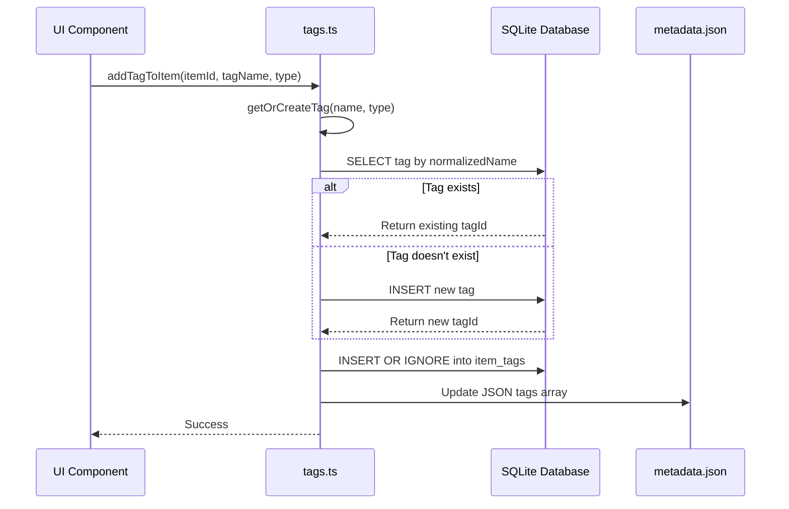
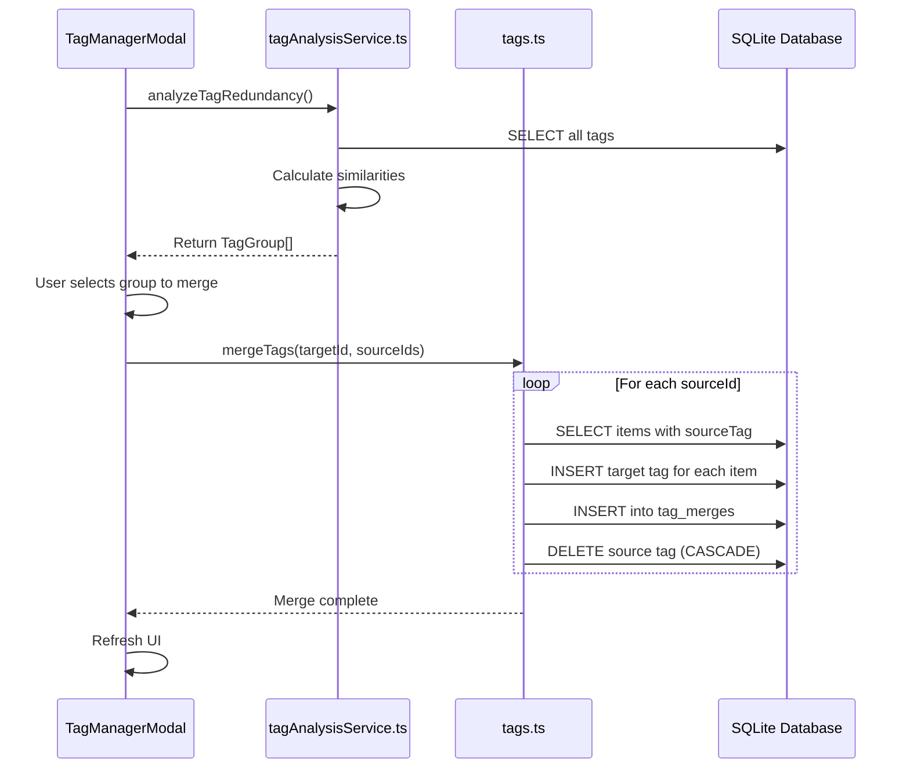
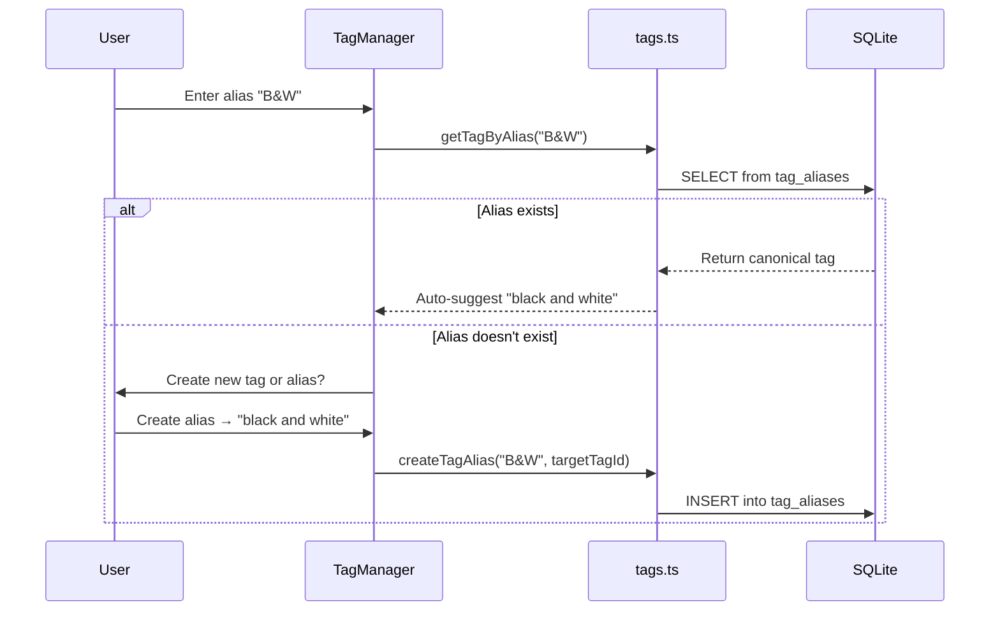

# Tag System Architecture - Technical Reference

## Table of Contents
- [Overview](#overview)
- [Database Schema](#database-schema)
- [Data Flow Architecture](#data-flow-architecture)
- [Similarity Detection Algorithms](#similarity-detection-algorithms)
- [API Reference](#api-reference)
- [Gemini AI Integration](#gemini-ai-integration)
- [Tag Aliases System](#tag-aliases-system)

---

## Overview

The Lumina Portfolio tag system implements a **dual-persistence architecture** that combines the reliability of JSON storage with the power of relational database queries. This design ensures data integrity while enabling advanced features like similarity detection, intelligent merging, and comprehensive analytics.

### Architecture Components

```
┌─────────────────────────────────────────────────────────────┐
│                    USER INTERFACE LAYER                     │
├─────────────────────────────────────────────────────────────┤
│  TagManager  │  ImageViewer  │  TagManagerModal            │
│  AddTagModal │  TagMergeHistory                             │
└──────────────┬──────────────────────────────┬───────────────┘
               │                              │
               ▼                              ▼
┌──────────────────────────┐   ┌─────────────────────────────┐
│  Storage Service Layer   │   │  Analysis Service Layer     │
│  (tags.ts)               │   │  (tagAnalysisService.ts)    │
├──────────────────────────┤   ├─────────────────────────────┤
│  • CRUD Operations       │   │  • Levenshtein Distance     │
│  • Tag Merging           │   │  • Jaccard Index            │
│  • Alias Management      │   │  • Redundancy Detection     │
│  • History Tracking      │   │  • Grouping Algorithms      │
└──────────────┬───────────┘   └─────────────────────────────┘
               │
               ▼
┌─────────────────────────────────────────────────────────────┐
│                    DATABASE LAYER (SQLite)                   │
├─────────────────────────────────────────────────────────────┤
│  tags (normalized)  │  item_tags (junction)                │
│  tag_merges (audit) │  tag_aliases (synonyms)              │
│  metadata (JSON backup)                                      │
└─────────────────────────────────────────────────────────────┘
```

### Key Design Principles

1. **Dual Persistence**: Tags stored in both JSON (backup) and relational tables (primary)
2. **Normalization**: Case-insensitive deduplication via `normalizedName` field
3. **Type Safety**: TypeScript interfaces matching exact database schema
4. **Audit Trail**: Complete merge history for transparency and potential undo
5. **Cascading Deletes**: Foreign key constraints maintain referential integrity

---

## Database Schema

### Relational Schema Diagram

```
┌─────────────────────────────────────────────┐
│              tags                           │
├─────────────────────────────────────────────┤
│ id (PK)           TEXT                      │
│ name              TEXT NOT NULL             │
│ normalizedName    TEXT NOT NULL             │◄────┐
│ type              TEXT NOT NULL             │     │
│ confidence        REAL                      │     │
│ createdAt         INTEGER NOT NULL          │     │
└────────┬────────────────────────────────────┘     │
         │                                           │
         │ 1:N                                       │
         │                                           │
         ▼                                           │
┌─────────────────────────────────────────────┐     │
│           item_tags                         │     │
├─────────────────────────────────────────────┤     │
│ itemId (PK, FK)   TEXT NOT NULL             │     │
│ tagId (PK, FK)    TEXT NOT NULL             │─────┤
│ addedAt           INTEGER NOT NULL          │     │
└─────────────────────────────────────────────┘     │
                                                     │
┌─────────────────────────────────────────────┐     │
│           tag_merges                        │     │
├─────────────────────────────────────────────┤     │
│ id (PK)           TEXT                      │     │
│ targetTagId (FK)  TEXT NOT NULL             │─────┤
│ sourceTagId       TEXT NOT NULL             │     │
│ mergedAt          INTEGER NOT NULL          │     │
│ mergedBy          TEXT                      │     │
└─────────────────────────────────────────────┘     │
                                                     │
┌─────────────────────────────────────────────┐     │
│           tag_aliases                       │     │
├─────────────────────────────────────────────┤     │
│ id (PK)           TEXT                      │     │
│ aliasName         TEXT NOT NULL (UNIQUE)    │     │
│ targetTagId (FK)  TEXT NOT NULL             │─────┘
│ createdAt         INTEGER NOT NULL          │
└─────────────────────────────────────────────┘
```

### Table Definitions

#### `tags` - Core Tag Definitions

```sql
CREATE TABLE tags (
  id TEXT PRIMARY KEY,              -- e.g., "tag-1703001234567-a1b2c3"
  name TEXT NOT NULL,               -- Display name (preserves original case)
  normalizedName TEXT NOT NULL,     -- Lowercase for deduplication
  type TEXT NOT NULL,               -- 'ai' | 'manual' | 'ai_detailed'
  confidence REAL,                  -- AI confidence score (0.0-1.0)
  createdAt INTEGER NOT NULL        -- Unix timestamp (ms)
);

CREATE UNIQUE INDEX idx_tags_normalized ON tags(normalizedName, type);
```

**Purpose**: Stores unique tag definitions with metadata. The `normalizedName` + `type` combination ensures no duplicate tags exist.

#### `item_tags` - Many-to-Many Relations

```sql
CREATE TABLE item_tags (
  itemId TEXT NOT NULL,             -- FK to metadata.id
  tagId TEXT NOT NULL,              -- FK to tags.id
  addedAt INTEGER NOT NULL,         -- Unix timestamp (ms)
  PRIMARY KEY (itemId, tagId),
  FOREIGN KEY (itemId) REFERENCES metadata(id) ON DELETE CASCADE,
  FOREIGN KEY (tagId) REFERENCES tags(id) ON DELETE CASCADE
);

CREATE INDEX idx_item_tags_item ON item_tags(itemId);
CREATE INDEX idx_item_tags_tag ON item_tags(tagId);
```

**Purpose**: Junction table linking items to tags. Composite primary key prevents duplicate associations. Cascade deletes ensure orphaned records are automatically cleaned up.

#### `tag_merges` - Audit History

```sql
CREATE TABLE tag_merges (
  id TEXT PRIMARY KEY,
  targetTagId TEXT NOT NULL,        -- Tag that was kept
  sourceTagId TEXT NOT NULL,        -- Tag that was deleted/merged
  mergedAt INTEGER NOT NULL,        -- Unix timestamp (ms)
  mergedBy TEXT,                    -- 'user' | 'auto' | NULL
  FOREIGN KEY (targetTagId) REFERENCES tags(id) ON DELETE CASCADE
);

CREATE INDEX idx_tag_merges_target ON tag_merges(targetTagId);
CREATE INDEX idx_tag_merges_merged_at ON tag_merges(mergedAt);
```

**Purpose**: Complete audit trail for all merge operations. Enables analytics, debugging, and potential undo functionality.

#### `tag_aliases` - Synonym Mappings

```sql
CREATE TABLE tag_aliases (
  id TEXT PRIMARY KEY,
  aliasName TEXT NOT NULL,          -- The synonym/alias
  targetTagId TEXT NOT NULL,        -- The canonical tag
  createdAt INTEGER NOT NULL,       -- Unix timestamp (ms)
  FOREIGN KEY (targetTagId) REFERENCES tags(id) ON DELETE CASCADE
);

CREATE UNIQUE INDEX idx_tag_aliases_name ON tag_aliases(aliasName);
CREATE INDEX idx_tag_aliases_target ON tag_aliases(targetTagId);
```

**Purpose**: Maps alternative tag names to canonical tags. Example: "B&W" → "black and white".

---

## Data Flow Architecture

### Tag Addition Flow

> **Note**: The diagrams below use Mermaid syntax. They will render automatically on GitHub and in most modern markdown viewers. If your viewer doesn't support Mermaid, you can view the rendered diagrams on GitHub or use a tool like [Mermaid Live Editor](https://mermaid.live/).



### Tag Merge Flow



### Double Save Architecture

The system maintains data in two locations:

1. **Primary: Relational Tables**
   - Used for queries, filtering, analytics
   - Source of truth for tag operations
   - Optimized for performance

2. **Backup: JSON in metadata**
   - Legacy compatibility
   - Fallback for data recovery
   - Synced via `syncAllTagsFromMetadata()`

**Sync Flow**:
```typescript
// Periodic or on-demand sync from JSON → Relational
await syncAllTagsFromMetadata();

// Flow:
// 1. Read all metadata rows
// 2. Parse aiTags, manualTags, aiTagsDetailed JSON
// 3. For each tag: getOrCreateTag()
// 4. For each item: addTagToItem()
// 5. Remove old associations first (clearTagsForItem)
```

---

## Similarity Detection Algorithms

### Levenshtein Distance

**Purpose**: Detect typos, plurals, and minor character variations.

**Algorithm**: Dynamic programming approach calculating minimum edit operations (insert, delete, substitute) to transform one string into another.

**Implementation**:
```typescript
const levenshteinDistance = (a: string, b: string): number => {
  const matrix: number[][] = [];

  // Initialize first column and row
  for (let i = 0; i <= b.length; i++) matrix[i] = [i];
  for (let j = 0; j <= a.length; j++) matrix[0][j] = j;

  // Fill matrix
  for (let i = 1; i <= b.length; i++) {
    for (let j = 1; j <= a.length; j++) {
      if (b.charAt(i - 1) === a.charAt(j - 1)) {
        matrix[i][j] = matrix[i - 1][j - 1];
      } else {
        matrix[i][j] = Math.min(
          matrix[i - 1][j - 1] + 1, // substitution
          matrix[i][j - 1] + 1,     // insertion
          matrix[i - 1][j] + 1      // deletion
        );
      }
    }
  }

  return matrix[b.length][a.length];
};
```

**Thresholds**:
- Distance ≤ 1: Very similar (e.g., "landscape" vs "landscapes")
- Distance ≤ 2 AND length > 5: Similar for longer words

**Time Complexity**: O(m × n) where m, n are string lengths  
**Space Complexity**: O(m × n)

**Examples**:
```typescript
levenshteinDistance("landscape", "landscapes")  // 1 (add 's')
levenshteinDistance("portrait", "portait")      // 1 (delete 'r')
levenshteinDistance("color", "colour")          // 1 (insert 'u')
levenshteinDistance("cat", "dog")               // 3 (too different)
```

---

### Jaccard Index (Token Similarity)

**Purpose**: Detect semantic similarity in multi-word tags by comparing word sets.

**Algorithm**: Set-based similarity using intersection over union.

**Formula**:
```
J(A, B) = |A ∩ B| / |A ∪ B|
```

**Implementation**:
```typescript
// Stop words filtered during tokenization
const STOP_WORDS = new Set([
  "et", "and", "&", "le", "la", "les", 
  "the", "a", "an", "de", "of", "in", "en"
]);

const tokenize = (str: string): Set<string> => {
  return new Set(
    str.toLowerCase()
      .replace(/[^\w\s]/g, "")  // Remove punctuation
      .split(/\s+/)
      .filter(w => w.length > 0 && !STOP_WORDS.has(w))
  );
};

const areTokensSimilar = (a: Set<string>, b: Set<string>): boolean => {
  if (a.size === 0 || b.size === 0) return false;
  
  const intersection = new Set([...a].filter(x => b.has(x)));
  const unionSize = new Set([...a, ...b]).size;
  const jaccard = intersection.size / unionSize;
  
  return jaccard >= 0.8;  // 80% threshold
};
```

**Threshold**: Jaccard ≥ 0.8 (80% similarity)

**Examples**:
```typescript
// "noir et blanc" → {"noir", "blanc"}
// "noir blanc" → {"noir", "blanc"}
// Jaccard = 2/2 = 1.0 ✅ Similar

// "blue sky sunset" → {"blue", "sky", "sunset"}
// "sunset sky" → {"sunset", "sky"}
// Jaccard = 2/3 = 0.67 ❌ Not similar enough

// "landscape nature" → {"landscape", "nature"}
// "nature photography" → {"nature", "photography"}
// Jaccard = 1/3 = 0.33 ❌ Not similar
```

**Why 0.8?**: High threshold ensures only truly similar tags are grouped, avoiding false positives.

---

### Combined Detection Strategy

Tags are considered similar if **ANY** of these conditions are met:

1. **Exact normalized match**: `normalizedName === normalizedName`
2. **Levenshtein match**: `distance ≤ 1` OR (`distance ≤ 2` AND `length > 5`)
3. **Token match**: `jaccardIndex >= 0.8`

```typescript
// From src/services/tagAnalysisService.ts:109-121
const dist = levenshteinDistance(root.simpleName, candidate.simpleName);

const isLevenshteinMatch = 
  dist <= 1 || 
  (dist <= 2 && root.simpleName.length > 5);

const isTokenMatch = areTokensSimilar(root.tokens, candidate.tokens);

if (isLevenshteinMatch || isTokenMatch || root.simpleName === candidate.simpleName) {
  group.candidates.push(candidate);
  processedIds.add(candidate.id);
}
```

---

## API Reference

### Core Tag Operations (`src/services/storage/tags.ts`)

#### `getOrCreateTag(name: string, type: TagType, confidence?: number): Promise<string>`

Creates a new tag or returns existing tag ID. Uses `normalizedName` for deduplication.

**Parameters**:
- `name`: Display name (preserves case)
- `type`: `'ai' | 'manual' | 'ai_detailed'`
- `confidence`: Optional AI confidence score (0.0-1.0)

**Returns**: Tag ID

**Example**:
```typescript
const tagId = await getOrCreateTag("Landscape", "manual");
// Returns existing ID if "landscape" already exists
```

---

#### `addTagToItem(itemId: string, tagId: string): Promise<void>`

Associates a tag with an item. Uses `INSERT OR IGNORE` for idempotency.

**Example**:
```typescript
await addTagToItem("item-123", "tag-456");
```

---

#### `removeTagFromItem(itemId: string, tagId: string): Promise<void>`

Removes a tag association from an item.

---

#### `getTagsForItem(itemId: string): Promise<ParsedTag[]>`

Retrieves all tags associated with an item.

**Returns**: Array of `ParsedTag` objects:
```typescript
interface ParsedTag {
  id: string;
  name: string;
  type: TagType;
  confidence?: number;
}
```

---

#### `getAllTags(type?: TagType): Promise<ParsedTag[]>`

Retrieves all tags, optionally filtered by type.

**Example**:
```typescript
const aiTags = await getAllTags("ai");
const allTags = await getAllTags();
```

---

#### `searchTags(query: string): Promise<ParsedTag[]>`

Fuzzy search tags by name. Uses SQL `LIKE` on `normalizedName`. Limits to 20 results.

**Example**:
```typescript
const results = await searchTags("land");
// Returns: ["landscape", "iceland", "thailand", ...]
```

---

#### `mergeTags(targetTagId: string, sourceTagIds: string[], mergedBy?: string): Promise<void>`

Merges multiple source tags into a target tag.

**Process**:
1. For each source tag:
   - Get all items with source tag
   - Add target tag to those items
   - Record merge in `tag_merges`
   - Delete source tag (cascade removes `item_tags`)

**Parameters**:
- `targetTagId`: Tag to keep
- `sourceTagIds`: Tags to merge and delete
- `mergedBy`: `'user' | 'auto'` (default: `'user'`)

**Example**:
```typescript
await mergeTags("tag-landscape", ["tag-landscapes", "tag-landschaft"], "user");
```

---

#### `syncAllTagsFromMetadata(): Promise<number>`

Syncs all tags from JSON metadata to relational tables. Used for migration or data recovery.

**Returns**: Number of items processed

**Example**:
```typescript
const count = await syncAllTagsFromMetadata();
console.log(`Synced ${count} items`);
```

---

#### `createTagAlias(aliasName: string, targetTagId: string): Promise<void>`

Creates an alias mapping to a canonical tag.

**Example**:
```typescript
await createTagAlias("B&W", "tag-black-and-white");
```

---

#### `getTagByAlias(aliasName: string): Promise<ParsedTag | null>`

Resolves an alias to its canonical tag.

**Example**:
```typescript
const tag = await getTagByAlias("B&W");
// Returns: { id: "tag-bw", name: "black and white", ... }
```

---

#### `getMergeHistory(tagId: string): Promise<Array<{...}>>`

Retrieves merge history for a specific tag.

**Returns**: Array of merge records:
```typescript
{
  id: string;
  sourceTagId: string;
  mergedAt: number;
  mergedBy: string | null;
}
```

---

### Analysis Operations (`src/services/tagAnalysisService.ts`)

#### `analyzeTagRedundancy(maxTags?: number): Promise<TagGroup[]>`

Analyzes all tags for similarity and groups duplicates.

**Parameters**:
- `maxTags`: Optional limit for testing/preview

**Returns**: Array of `TagGroup` objects:
```typescript
interface TagGroup {
  target: ParsedTag;      // Canonical tag
  candidates: ParsedTag[];  // Similar tags to merge
}
```

**Performance**: Optimized for large datasets (>5000 tags). Uses O(n²) comparison with early termination.

**Example**:
```typescript
const groups = await analyzeTagRedundancy();
groups.forEach(group => {
  console.log(`${group.target.name} ← [${group.candidates.map(c => c.name).join(', ')}]`);
});
// Output: "landscape ← [landscapes, landschaft]"
```

---

## Gemini AI Integration

### Overview

Lumina Portfolio integrates Google's Gemini AI for automatic image analysis and tag generation.

### Data Flow

```
ImageViewer → useVision hook → geminiService.ts → Gemini API
                                        ↓
                                ParsedTag[] (ai/ai_detailed)
                                        ↓
                                  tags.ts → SQLite
```

### Implementation

**Location**: `src/features/vision/services/geminiService.ts`

**Key Functions**:
```typescript
// Analyze image and generate tags
analyzeImage(imagePath: string): Promise<{
  description: string;
  tags: string[];
  detailedTags: Array<{ name: string; confidence: number }>;
}>
```

### Tag Types from AI

1. **Simple AI Tags** (`type: 'ai'`):
   - Quick categorization
   - Examples: "portrait", "landscape", "architecture"

2. **Detailed AI Tags** (`type: 'ai_detailed'`):
   - Includes confidence scores
   - Example: `{ name: "sunset", confidence: 0.95 }`

### Storage Integration

```typescript
// From ImageViewer component flow:
const result = await analyzeImage(imagePath);

// Store AI tags
for (const tag of result.tags) {
  const tagId = await getOrCreateTag(tag, "ai");
  await addTagToItem(itemId, tagId);
}

// Store detailed AI tags
for (const detail of result.detailedTags) {
  const tagId = await getOrCreateTag(detail.name, "ai_detailed", detail.confidence);
  await addTagToItem(itemId, tagId);
}
```

---

## Tag Aliases System

### Purpose

Aliases allow users to define alternative names for tags, enabling:
- Synonym mapping ("B&W" → "black and white")
- Multi-language support ("paysage" → "landscape")
- Abbreviation expansion ("HDR" → "High Dynamic Range")

### Workflow



### API Usage

```typescript
// Create an alias
await createTagAlias("noir et blanc", "tag-black-and-white");

// Resolve alias when user types
const tag = await getTagByAlias("noir et blanc");
if (tag) {
  // Use canonical tag instead
  await addTagToItem(itemId, tag.id);
}

// Get all aliases for a tag
const aliases = await getAliasesForTag("tag-black-and-white");
// Returns: ["B&W", "noir et blanc", "monochrome"]
```

### Implementation in UI

**Reference**: `src/features/tags/components/TagManager.tsx` (lines 26-47)

```typescript
// Pseudo-code from TagManager
const handleTagInput = async (input: string) => {
  const aliasTag = await getTagByAlias(input);
  
  if (aliasTag) {
    // Show suggestion: "Did you mean '{aliasTag.name}'?"
    setSuggestion(aliasTag.name);
  } else {
    // Normal tag creation flow
    await createTag(input);
  }
};
```

---

## Performance Considerations

### Large Dataset Optimizations

1. **Threshold Warning**: Alerts when analyzing >5000 tags
2. **Pagination**: TagMergeHistory shows 20 entries per page
3. **Indexed Queries**: All foreign keys have indexes
4. **Batch Operations**: `mergeTags` processes multiple sources efficiently

### Caching Strategy

- Tags loaded once per session via `getAllTags()`
- UI components cache results locally
- Database queries use prepared statements via SQLite plugin

---

## Future Enhancements

### Planned Features

1. **Undo Merge**: Use `tag_merges` audit trail to reverse operations
2. **Tag Statistics**: Analytics dashboard showing:
   - Most used tags
   - Tag growth over time
   - Merge operation frequency
3. **Bulk Import/Export**: CSV support for tag definitions and aliases
4. **Hierarchical Tags**: Parent-child relationships (e.g., "Architecture" → "Modern", "Classical")
5. **Auto-Alias Detection**: ML-based suggestion of potential aliases

### Migration Notes

When upgrading from older versions:
1. Run `syncAllTagsFromMetadata()` to populate relational tables
2. Verify tag counts match: JSON vs relational
3. Check for orphaned `item_tags` records

---

## References

### Source Files

- **Core Storage**: `src/services/storage/tags.ts` (414 lines)
- **Analysis Service**: `src/services/tagAnalysisService.ts` (135 lines)
- **Database Schema**: `src/services/storage/db.ts` (lines 140-180)
- **Type Definitions**: `src/shared/types/database.ts` (lines 133-176)

### Related Documentation

- [User Guide](./TAG_SYSTEM_GUIDE.md) - End-user documentation
- [Tag Consolidation Spec](../../ARCHIVES/historical/TAG_CONSOLIDATION_SPEC.md)
- [Database Migration v2.01](../../ARCHIVES/historical/DB_MIGRATION_v2.01.md) - Schema updates

### External Resources

- [Levenshtein Distance Algorithm](https://en.wikipedia.org/wiki/Levenshtein_distance)
- [Jaccard Index](https://en.wikipedia.org/wiki/Jaccard_index)
- [SQLite Foreign Keys](https://www.sqlite.org/foreignkeys.html)
- [Gemini API Documentation](https://ai.google.dev/docs)

---

**Last Updated**: 2024-12-30  
**Version**: 2.0  
**Maintained By**: Lumina Portfolio Development Team
