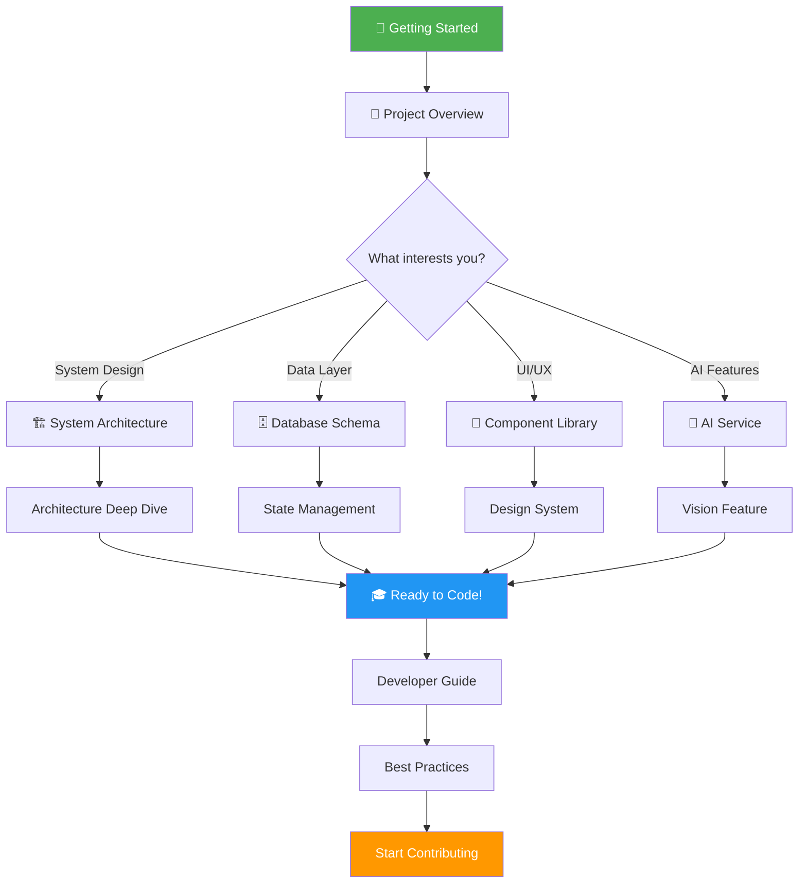
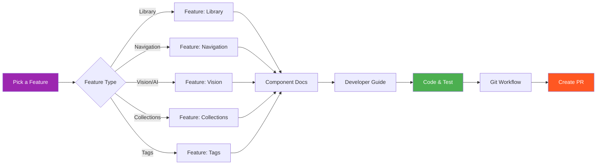
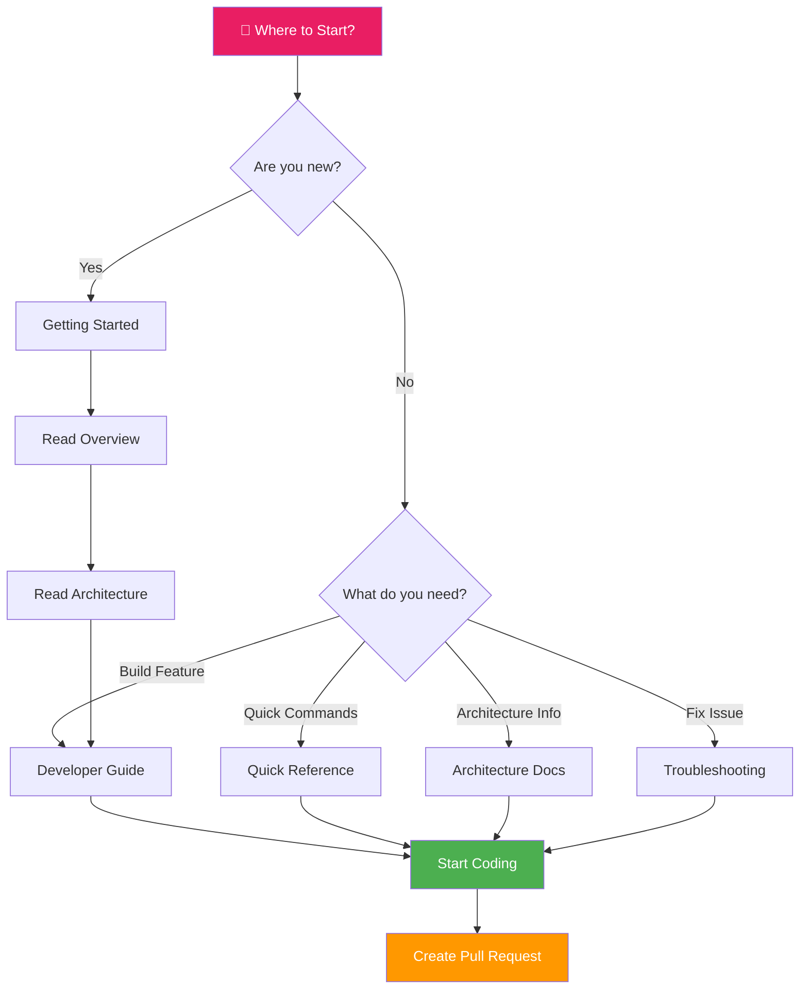

# 📚 Documentation Map - Lumina Portfolio

**Visual guide to navigate the documentation**  
**Version**: 0.3.0-beta.1 | **Last update**: January 6, 2026

[](./INDEX.md)
[](./QUICK_REFERENCE.md)
[](./AUDIT/2026-01-06_EXECUTIVE_SUMMARY.md)

---

## 🎯 Choose Your Path

**→ New to the project?** Start with [Getting Started](#-new-to-the-project)  
**→ Need quick commands?** Check [Quick Reference](./QUICK_REFERENCE.md)  
**→ Want visual overview?** See [Learning Paths](#-recommended-learning-paths) below  
**→ Looking for specific topic?** Use [Search by Topic](#-documentation-by-topic)

```
📁 Lumina Portfolio Documentation
│
├── 🚀 GETTING STARTED
│   └── /docs/getting-started/
│       ├── README.md          → Installation & First Steps
│       └── QUICK_START.md     → 10-Minute GitHub Setup
│
├── 📦 RELEASE NOTES
│   ├── RELEASE_NOTES_v0.3.0-beta.1.md  → Current Release (NEW!)
│   └── CHANGELOG.md                     → Full History
│
├── 📖 TECHNICAL GUIDES
│   └── /docs/guides/
│       │
│       ├── 🏗️  ARCHITECTURE
│       │   ├── ARCHITECTURE.md              → System Design
│       │   ├── AI_SERVICE.md                → Gemini Integration
│       │   ├── GIT_WORKFLOW.md              → Git Architecture
│       │   ├── TAG_SYSTEM_ARCHITECTURE.md   → Tag System Design
│       │   └── TAG_SYSTEM_GUIDE.md          → Tag System Usage
│       │
│       ├── ✨ FEATURES
│       │   ├── COMPONENTS.md           → UI Component Library
│       │   ├── DESIGN_SYSTEM.md        → Design System (NEW!)
│       │   ├── INTERACTIONS.md         → UX & Keyboard Shortcuts
│       │   ├── I18N_GUIDE.md          → Internationalization
│       │   └── TAG_SYSTEM_README.md    → Tag Feature Overview
│       │
│       └── 📁 PROJECT
│           ├── CHANGELOG.md              → Version History
│           ├── REFACTORING_PLAN.md       → Future Plans
│           ├── bonne-pratique.md         → Best Practices
│           ├── COMMERCIAL_AUDIT.md       → Audit Report
│           └── KnowledgeBase/            → Comprehensive Docs
│               ├── 01_Project_Overview.md
│               ├── 02_Architecture_Deep_Dive.md
│               ├── 03_Database_Schema_and_Storage.md
│               ├── 04_Component_Library.md
│               ├── 05_Services_and_Logic.md
│               ├── 06_AI_Integration.md
│               ├── 07_Developer_Guide.md
│               ├── 08_Troubleshooting_and_FAQ.md
│               ├── 09_State_Management.md
│               ├── 10_Feature_Library.md
│               ├── 11_Feature_Navigation.md
│               ├── 12_Feature_Vision.md
│               ├── 13_Feature_Collections.md
│               └── 14_Feature_Tags.md
│
├── 🔄 WORKFLOWS
│   └── /docs/workflows/
│       ├── README.md                              → Workflow Hub
│       ├── BRANCH_STRATEGY.md                     → Git Branching
│       ├── CONFIGURATION_GITHUB_FR.md             → GitHub Setup
│       ├── CREATE_RELEASE_BRANCH_INSTRUCTIONS.md  → Release Process
│       └── GITHUB_SETUP_SUMMARY.md                → Setup Summary
│
├── 📦 ARCHIVES
│   └── /docs/ARCHIVES/
│       └── Historical documentation & migration guides
│
└── 🔍 AUDIT
    └── /docs/AUDIT/
        └── Security & quality audit reports
```

---

## 🎯 Where to Start?

### New to the Project?

1. **[Getting Started](./getting-started/README.md)** - Installation & setup
2. **[Project Overview](./guides/project/KnowledgeBase/01_Project_Overview.md)** - Understand the project
3. **[Quick Start](./getting-started/QUICK_START.md)** - GitHub configuration

### Want to Understand the Architecture?

1. **[System Architecture](./guides/architecture/ARCHITECTURE.md)** - High-level design
2. **[Architecture Deep Dive](./guides/project/KnowledgeBase/02_Architecture_Deep_Dive.md)** - Detailed architecture
3. **[Database Schema](./guides/project/KnowledgeBase/03_Database_Schema_and_Storage.md)** - Data design

### Want to Develop Features?

1. **[Developer Guide](./guides/project/KnowledgeBase/07_Developer_Guide.md)** - Development workflow
2. **[Component Library](./guides/features/COMPONENTS.md)** - UI components
3. **[Best Practices](./guides/project/bonne-pratique.md)** - Coding standards

### Working with Git/GitHub?

1. **[Branch Strategy](./workflows/BRANCH_STRATEGY.md)** - Git workflow
2. **[GitHub Configuration](./workflows/CONFIGURATION_GITHUB_FR.md)** - Repository setup
3. **[Release Process](./workflows/CREATE_RELEASE_BRANCH_INSTRUCTIONS.md)** - Creating releases

### Need Help?

1. **[Troubleshooting & FAQ](./guides/project/KnowledgeBase/08_Troubleshooting_and_FAQ.md)** - Common issues
2. **[GitHub Issues](https://github.com/groovybronx/portf84/issues)** - Report bugs

---

## 📋 Documentation by Role

### 🆕 New Contributors

- [Getting Started](./getting-started/README.md)
- [Project Overview](./guides/project/KnowledgeBase/01_Project_Overview.md)
- [Developer Guide](./guides/project/KnowledgeBase/07_Developer_Guide.md)
- [Git Workflow](./workflows/BRANCH_STRATEGY.md)

### 💻 Frontend Developers

- [Component Library](./guides/features/COMPONENTS.md)
- [Interactions Guide](./guides/features/INTERACTIONS.md)
- [i18n Guide](./guides/features/I18N_GUIDE.md)
- [State Management](./guides/project/KnowledgeBase/09_State_Management.md)

### 🦀 Backend Developers

- [Architecture](./guides/architecture/ARCHITECTURE.md)
- [Database Schema](./guides/project/KnowledgeBase/03_Database_Schema_and_Storage.md)
- [Services & Logic](./guides/project/KnowledgeBase/05_Services_and_Logic.md)

### 🤖 AI Integration

- [AI Service](./guides/architecture/AI_SERVICE.md)
- [AI Integration Details](./guides/project/KnowledgeBase/06_AI_Integration.md)
- [Vision Feature](./guides/project/KnowledgeBase/12_Feature_Vision.md)

### 🎨 UI/UX Designers

- [Component Library](./guides/features/COMPONENTS.md)
- [Interactions Guide](./guides/features/INTERACTIONS.md)
- [Library Feature](./guides/project/KnowledgeBase/10_Feature_Library.md)

### 🔧 DevOps/Maintainers

- [Git Workflow](./workflows/BRANCH_STRATEGY.md)
- [Release Process](./workflows/CREATE_RELEASE_BRANCH_INSTRUCTIONS.md)
- [Changelog](./guides/project/CHANGELOG.md)

---

## 🔍 Documentation by Topic

### Architecture & Design

- [System Architecture](./guides/architecture/ARCHITECTURE.md)
- [Architecture Deep Dive](./guides/project/KnowledgeBase/02_Architecture_Deep_Dive.md)
- [Git Workflow Architecture](./guides/architecture/GIT_WORKFLOW.md)

### Database & Storage

- [Database Schema](./guides/project/KnowledgeBase/03_Database_Schema_and_Storage.md)
- [State Management](./guides/project/KnowledgeBase/09_State_Management.md)

### Features

- [Library Feature](./guides/project/KnowledgeBase/10_Feature_Library.md)
- [Navigation Feature](./guides/project/KnowledgeBase/11_Feature_Navigation.md)
- [Vision Feature](./guides/project/KnowledgeBase/12_Feature_Vision.md)
- [Collections Feature](./guides/project/KnowledgeBase/13_Feature_Collections.md)
- [Tags Feature](./guides/project/KnowledgeBase/14_Feature_Tags.md)

### Tag System

- [Tag System Architecture](./guides/architecture/TAG_SYSTEM_ARCHITECTURE.md)
- [Tag System Guide](./guides/architecture/TAG_SYSTEM_GUIDE.md)
- [Tag System README](./guides/features/TAG_SYSTEM_README.md)
- [Tags Feature Details](./guides/project/KnowledgeBase/14_Feature_Tags.md)

### AI & Machine Learning

- [AI Service](./guides/architecture/AI_SERVICE.md)
- [AI Integration](./guides/project/KnowledgeBase/06_AI_Integration.md)
- [Vision Feature](./guides/project/KnowledgeBase/12_Feature_Vision.md)

### User Interface

- [Component Library](./guides/features/COMPONENTS.md)
- [Component Reference](./guides/project/KnowledgeBase/04_Component_Library.md)
- [Interactions](./guides/features/INTERACTIONS.md)
- [i18n Guide](./guides/features/I18N_GUIDE.md)

### Development & Workflow

- [Developer Guide](./guides/project/KnowledgeBase/07_Developer_Guide.md)
- [Best Practices](./guides/project/bonne-pratique.md)
- [Branch Strategy](./workflows/BRANCH_STRATEGY.md)
- [GitHub Configuration](./workflows/CONFIGURATION_GITHUB_FR.md)

---

## 📊 Visual Documentation Flow

### Architecture Learning Flow



### Feature Development Flow



### Documentation Navigation Flow



---

## 🎓 Recommended Learning Paths

### Path 1: New Contributor (4-6 hours) 🆕

**Goal**: Get from zero to first contribution

```
Step 1: Installation (30 min)
├─ Read: Getting Started
├─ Action: Install dependencies
└─ Action: Run app locally

Step 2: Understanding (1.5 hours)
├─ Read: Project Overview
├─ Read: System Architecture
└─ Skim: Component Library

Step 3: Development Setup (1 hour)
├─ Read: Developer Guide
├─ Read: Git Workflow
└─ Read: Best Practices

Step 4: Pick a Feature (2 hours)
├─ Browse: Feature docs (choose one)
├─ Read: Related components
└─ Study: Example code

Step 5: Start Contributing! 🚀
├─ Pick a good-first-issue
├─ Create feature branch
└─ Code, test, PR!
```

**Estimated Reading**: ~4 hours  
**Hands-on Practice**: 2+ hours

---

### Path 2: Architecture Deep Dive (6-8 hours) 🏗️

**Goal**: Understand system design and technical decisions

```
Phase 1: High-Level Design (2 hours)
├─ Read: System Architecture (detailed)
├─ Read: Architecture Deep Dive
└─ Study: Project structure

Phase 2: Data Layer (2 hours)
├─ Read: Database Schema
├─ Read: State Management
└─ Review: SQLite migrations

Phase 3: Business Logic (2 hours)
├─ Read: Services & Logic
├─ Study: Tag System Architecture
└─ Review: Service layer code

Phase 4: AI Integration (1.5 hours)
├─ Read: AI Service
├─ Read: AI Integration Details
└─ Study: Gemini API usage

Phase 5: Git & Deployment (30 min)
├─ Read: Git Workflow Architecture
└─ Review: CI/CD setup
```

**Estimated Reading**: ~6-8 hours  
**Deep Technical**: Advanced level

---

### Path 3: UI/UX Developer (3-5 hours) 🎨

**Goal**: Master the component library and design system

```
Part 1: Design Foundation (1.5 hours)
├─ Read: Component Library
├─ Read: Design System
└─ Study: Glass morphism patterns

Part 2: Interaction Patterns (1 hour)
├─ Read: Interactions Guide
├─ Review: Keyboard shortcuts
└─ Study: Drag & drop implementation

Part 3: Feature UIs (1.5 hours)
├─ Read: Library Feature (photo grid)
├─ Read: Navigation Feature (sidebar)
└─ Read: Vision Feature (image viewer)

Part 4: Hands-On Building (1+ hours)
├─ Build a sample component
├─ Apply design system
└─ Add animations
```

**Estimated Reading**: ~3 hours  
**Hands-on Practice**: 2+ hours

---

### Path 4: AI Feature Developer (3-4 hours) 🤖

**Goal**: Work with Gemini AI integration

```
Module 1: AI Architecture (1 hour)
├─ Read: AI Service Overview
├─ Study: Prompt engineering
└─ Review: Streaming implementation

Module 2: Integration Details (1.5 hours)
├─ Read: AI Integration Details
├─ Study: Batch processing
└─ Review: Error handling

Module 3: Vision Feature (1 hour)
├─ Read: Vision Feature docs
├─ Study: Image analysis workflow
└─ Review: TagHub integration

Module 4: Hands-On (1+ hours)
├─ Test AI analysis locally
├─ Experiment with prompts
└─ Build a mini feature
```

**Estimated Reading**: ~3 hours  
**API Practice**: 1+ hours

---

## 📖 Cross-Reference Guide

### When Reading About... Also Check...

| Primary Topic | Related Docs | Why? |
|--------------|--------------|------|
| **System Architecture** | → State Management<br>→ Database Schema | Understand data flow and storage |
| **Component Library** | → Design System<br>→ Interactions | Learn styling patterns and UX |
| **Tag System** | → Database Schema<br>→ AI Service | See storage and AI tag generation |
| **AI Service** | → Vision Feature<br>→ Tag System | Understand AI usage in features |
| **Library Feature** | → Component Library<br>→ State Management | Learn UI components and state |
| **Git Workflow** | → Branch Strategy<br>→ Release Process | Complete Git understanding |

---

## ⏱️ Estimated Reading Times

### Quick Reads (< 15 min)
- Quick Reference: 5-10 min
- Project Overview: 10-15 min
- Quick Start (GitHub): 10 min
- Troubleshooting (scan): 10 min

### Medium Reads (15-45 min)
- System Architecture: 30-45 min
- Component Library: 25-35 min
- Developer Guide: 30-40 min
- AI Service: 25-35 min
- Any Feature doc: 20-30 min

### Deep Reads (45+ min)
- Architecture Deep Dive: 60-90 min
- Database Schema: 45-60 min
- Knowledge Base (any): 45-75 min
- State Management: 45-60 min

### Complete Coverage (hours)
- All Architecture docs: 4-5 hours
- All Feature docs: 3-4 hours
- All Knowledge Base: 10-12 hours
- Everything: 20-25 hours

---

## 📊 Documentation Statistics

- **Total Documents**: 54 markdown files
- **Main Sections**: 3 (Getting Started, Guides, Workflows)
- **Architecture Docs**: 5
- **Feature Docs**: 4
- **Knowledge Base**: 14 detailed guides
- **Workflow Docs**: 4

---

## 🗺️ Quick Reference

| I want to...                | Go to...                                                                        |
| --------------------------- | ------------------------------------------------------------------------------- |
| Install the application     | [Getting Started](./getting-started/README.md)                                  |
| Understand the architecture | [Architecture](./guides/architecture/ARCHITECTURE.md)                           |
| Learn about components      | [Components](./guides/features/COMPONENTS.md)                                   |
| See keyboard shortcuts      | [Interactions](./guides/features/INTERACTIONS.md)                               |
| Set up GitHub               | [Quick Start](./getting-started/QUICK_START.md)                                 |
| Understand Git workflow     | [Branch Strategy](./workflows/BRANCH_STRATEGY.md)                               |
| Create a release            | [Release Instructions](./workflows/CREATE_RELEASE_BRANCH_INSTRUCTIONS.md)       |
| Fix a problem               | [Troubleshooting](./guides/project/KnowledgeBase/08_Troubleshooting_and_FAQ.md) |
| Add a new language          | [i18n Guide](./guides/features/I18N_GUIDE.md)                                   |
| Work with the AI service    | [AI Service](./guides/architecture/AI_SERVICE.md)                               |
| Understand the tag system   | [Tag Architecture](./guides/architecture/TAG_SYSTEM_ARCHITECTURE.md)            |
| See version history         | [Changelog](./guides/project/CHANGELOG.md)                                      |

---

**Navigate efficiently through the Lumina Portfolio documentation! 🧭**

---

<div align="center">

**Choose Your Navigation Style**

[📚 Master Index (Visual)](./INDEX.md) | [⚡ Quick Reference (Cheat Sheet)](./QUICK_REFERENCE.md) | [📊 Latest Audit](./AUDIT/2026-01-06_EXECUTIVE_SUMMARY.md)

[🏠 Back to Technical Docs](./README.md) | [🚀 Getting Started](./getting-started/README.md) | [💻 Developer Guide](./guides/project/KnowledgeBase/07_Developer_Guide.md)

</div>

