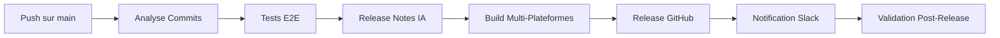

# 🚀 Guide du Workflow de Release Amélioré

## 🎯 Vue d'Ensemble

Ce guide présente le workflow de release amélioré avec les 4 fonctionnalités demandées :

1. **Intégration Slack** : Notifications automatiques
2. **Rollback Automatique** : Restauration en cas d'échec
3. **Release Notes IA** : Génération intelligente des notes
4. **Tests E2E** : Validation complète de l'application

## 📁 Fichiers Créés

### Workflows Principaux

- `release-enhanced.yml` : Workflow de release amélioré
- `slack-notifier.yml` : Notifications Slack dédiées
- `rollback.yml` : Rollback manuel et automatique

### Configuration Tests

- `playwright.config.ts` : Configuration E2E multi-plateformes
- `tests/e2e/basic.spec.ts` : Tests E2E de base

### Dépendances

- `@playwright/test` : Framework E2E
- Scripts npm pour les tests E2E

## 🔄 Workflow Amélioré

### 1. Analyse Intelligente



### 2. Tests E2E Intégrés

- **Exécution avant release** : Validation complète
- **Multi-plateformes** : macOS, Linux, Windows
- **Tests par plateforme** : Spécificités OS
- **Rapports détaillés** : HTML et traces

### 3. Release Notes par IA

- **Analyse automatique** des commits
- **Catégorisation intelligente** (feat, fix, perf, etc.)
- **Génération structurée** des notes
- **Formatage markdown** professionnel

### 4. Notifications Slack

- **Release créée** : Annonce avec détails
- **Workflow terminé** : Statut et liens
- **Rollback effectué** : Alertes urgentes
- **Déploiement production** : Confirmation

### 5. Rollback Automatique

- **Détection d'échec** : Surveillance automatique
- **Checkpoint de sécurité** : Point de restauration
- **Rollback conditionnel** : Optionnel manuel
- **Validation post-rollback** : Tests de confirmation

## 🛠️ Configuration

### Secrets GitHub Requis

```bash
# Slack Integration
SLACK_WEBHOOK_URL=https://hooks.slack.com/services/...

# Optionnel pour rollback avancé
GITHUB_TOKEN=automatiquement_fourni
```

### Dépendances à Installer

```bash
npm install --save-dev @playwright/test
npm install --save-dev @commitlint/cli @commitlint/config-conventional
```

### Scripts npm Ajoutés

```json
{
  "test:e2e": "playwright test",
  "test:e2e:platform": "playwright test --project",
  "commitlint": "commitlint --edit"
}
```

## 📋 Utilisation

### 1. Release Automatique (Standard)

```bash
# Push sur main → Release stable
git push origin main

# Push sur develop → Pré-release beta
git push origin develop
```

### 2. Release Manuelle (Contrôlée)

1. GitHub → Actions → Enhanced Semantic Release
2. "Run workflow"
3. Choisir les options :
   - Type de version (patch/minor/major/prerelease)
   - Tag de pré-release (beta, rc)
   - Activer rollback automatique

### 3. Rollback Manuel

1. GitHub → Actions → Release Rollback
2. "Run workflow"
3. Spécifier :
   - Tag cible (ex: v1.2.3)
   - Créer release de rollback
   - Notifier Slack

### 4. Tests E2E

```bash
# Exécuter tous les tests
npm run test:e2e

# Tests par plateforme
npm run test:e2e:platform -- --project=chromium
npm run test:e2e:platform -- --project=firefox
npm run test:e2e:platform -- --project=webkit
```

## 🎨 Messages Slack

### Release Succès

```
🎉 Release Stable: v1.2.3
Version: v1.2.3
Type: Release Stable
Publié par: developpeur
Date: 09/01/2026 17:30
[📦 Télécharger] [📋 Release Notes]
```

### Release Échec

```
❌ Workflow Release - Échec
Workflow: Enhanced Semantic Release
Statut: Échec
Déclenché par: developpeur
Durée: 15:42:13
[🔍 Voir les Logs]
```

### Rollback Effectué

```
🔄 ROLLBACK EFFECTUÉ
Tag Cible: v1.2.2
Déclenché par: admin
Commits Annulés: 15
Fonctionnalités Perdues: 3
[🔍 Voir le Rollback] [🔀 Pull Request]
```

## 🧪 Tests E2E

### Tests de Base

- **Chargement application** : Vérification démarrage
- **Navigation** : Éléments principaux présents
- **Library view** : Affichage des photos
- **Settings modal** : Ouverture/fermeture
- **Search** : Fonctionnalité de recherche
- **Photo grid** : Grille d'images
- **Responsive design** : Mobile/Desktop
- **Error handling** : Gestion des erreurs
- **Keyboard navigation** : Accessibilité

### Tests Spécifiques

- **macOS** : Title bar, menu bar
- **Windows** : Title bar, controls
- **Linux** : Title bar, decorations

### Configuration Playwright

```typescript
export default defineConfig({
  testDir: './tests/e2e',
  projects: [
    { name: 'chromium', use: { ...devices['Desktop Chrome'] } },
    { name: 'firefox', use: { ...devices['Desktop Firefox'] } },
    { name: 'webkit', use: { ...devices['Desktop Safari'] } },
  ],
  webServer: {
    command: 'npm run tauri:dev',
    url: 'http://localhost:1420',
    timeout: 120 * 1000,
  },
});
```

## 🔄 Rollback Automatique

### Déclenchement

- **Échec de build** : Compilation échoue
- **Tests E2E échouent** : Validation échoue
- **Option manuel** : Via workflow_dispatch

### Processus

1. **Détection** : Échec identifié
2. **Checkpoint** : Tag de rollback créé
3. **Analyse** : Impact évalué
4. **Restauration** : Reset au tag précédent
5. **Notification** : Slack alerté
6. **Validation** : Tests post-rollback

### Types de Rollback

- **Automatique** : Immédiat sur échec critique
- **Manuel** : Contrôlé via interface
- **Partiel** : Rollback de composants spécifiques

## 📊 Monitoring et Rapports

### GitHub Actions Summary

- Version créée
- Statut des builds
- Résultats des tests
- Liens vers assets

### Slack Notifications

- Release créée
- Workflow terminé
- Rollback effectué
- Déploiement validé

### Rapports E2E

- HTML détaillé
- Screenshots d'échec
- Traces d'exécution
- Vidéos (optionnel)

## 🚀 Bonnes Pratiques

### Avant la Release

1. **Tests locaux** : `npm test && npm run test:e2e`
2. **Commits propres** : Conventional commits
3. **Documentation** : Mise à jour si nécessaire
4. **Backup** : Checkpoint manuel si critique

### Pendant la Release

1. **Surveillance** : Logs GitHub Actions
2. **Validation** : Assets générés
3. **Communication** : Équipe informée

### Après la Release

1. **Tests production** : Validation utilisateur
2. **Monitoring** : Erreurs éventuelles
3. **Documentation** : Release notes finales
4. **Régression** : Tests complets

## 🔧 Dépannage

### Problèmes Communs

#### Tests E2E échouent

```bash
# Réinitialiser Playwright
npx playwright install

# Vérifier configuration
npm run tauri:dev  # Doit démarrer sur localhost:1420
```

#### Slack notifications ne fonctionnent pas

```bash
# Vérifier webhook
curl -X POST -H 'Content-type: application/json' \
  --data '{"text":"test"}' \
  $SLACK_WEBHOOK_URL
```

#### Rollback échoue

- Vérifier les permissions GitHub
- Confirmer que le tag existe
- Valider les accès au repository

## 📈 Métriques et KPIs

### Release Metrics

- **Temps de release** : Durée totale
- **Succès rate** : Pourcentage de réussite
- **Rollback frequency** : Fréquence de rollback
- **Test coverage** : Couverture E2E

### Slack Metrics

- **Notification delivery** : Taux de livraison
- **Response time** : Temps de réponse
- **Engagement** : Clics sur liens

### E2E Metrics

- **Pass rate** : Tests passés
- **Execution time** : Durée des tests
- **Flakiness** : Tests instables

## 🎯 Roadmap Future

### Prochaines Améliorations

1. **AI Testing** : Tests générés par IA
2. **Canary Releases** : Déploiement progressif
3. **A/B Testing** : Validation fonctionnelle
4. **Performance Testing** : Tests de charge
5. **Security Scanning** : Analyse de sécurité

### Intégrations Possibles

- **Jira** : Ticketing et suivi
- **Sentry** : Monitoring erreurs
- **Datadog** : Monitoring performance
- **Figma** : Design sync

---

## 📞 Support

Pour toute question sur le workflow amélioré :

1. Consulter les logs GitHub Actions
2. Vérifier la documentation technique
3. Contacter l'équipe de développement
4. Analyser les rapports E2E

---

_Ce workflow amélioré offre une release robuste, sécurisée et complètement automatisée avec monitoring complet._
