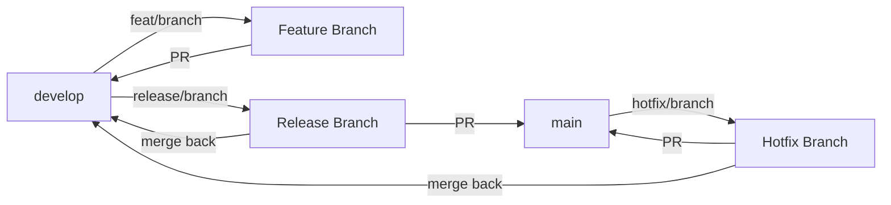

# Workflow Git - Lumina Portfolio

## 🌳 Structure des Branches

Le projet utilise un **Git Flow** simplifié avec deux branches principales :

### Branches Permanentes

| Branche | Rôle | Protection |
|---------|------|------------|
| **`main`** | Production stable | ✅ Protégée - Merge via PR uniquement |
| **`develop`** | Intégration développement | ➡️ Branche par défaut pour les PR |

### Branches Temporaires

| Type | Nomenclature | Base | Merge vers |
|------|--------------|------|------------|
| **Feature** | `feat/nom-feature` | `develop` | `develop` |
| **Bugfix** | `fix/nom-bug` | `develop` | `develop` |
| **Hotfix** | `hotfix/nom-urgence` | `main` | `main` + `develop` |
| **Release** | `release/vX.Y.Z` | `develop` | `main` + `develop` |

---

## 🔄 Workflow Standard

### 1. Créer une Feature Branch

```bash
# Mettre à jour develop
git checkout develop
git pull origin develop

# Créer une branche de feature
git checkout -b feat/ma-nouvelle-feature

# Développer...
# Commit régulièrement
git add .
git commit -m "feat: description du changement"
```

### 2. Pousser et Créer une Pull Request

```bash
# Pousser la branche
git push -u origin feat/ma-nouvelle-feature

# Créer une PR vers `develop` sur GitHub
# URL: https://github.com/groovybronx/portf84/compare/develop...feat/ma-nouvelle-feature
```

### 3. Merger dans `develop`

1. **Review de la PR** sur GitHub
2. **Activer** les checks automatiques si configurés (CI/CD)
3. **Merger** vers `develop` (Squash and merge recommandé)
4. **Supprimer** la branche de feature

### 4. Release vers `main`

Quand `develop` est stable et prêt pour la production :

```bash
# Créer une branche de release
git checkout develop
git pull origin develop
git checkout -b release/v1.2.0

# Bump version dans package.json et tauri.conf.json
# Commit
git commit -m "chore: bump version to 1.2.0"

# Push et PR vers main
git push -u origin release/v1.2.0
```

**Sur GitHub** :
1. Créer une PR : `release/v1.2.0` → `main`
2. Review et merge
3. Créer un **Tag** `v1.2.0` sur `main`
4. Merger `main` dans `develop` pour synchroniser

---

## 🚨 Hotfix (Urgence Production)

Pour une correction urgente sur `main` :

```bash
# Créer depuis main
git checkout main
git pull origin main
git checkout -b hotfix/critical-bug

# Fix rapide
git commit -m "fix: correction urgente"

# Push
git push -u origin hotfix/critical-bug

# PR vers main ET develop
```

---

## 📋 Règles de Commits

### Convention

Utiliser **Conventional Commits** :

```
type(scope): description

[optional body]

[optional footer]
```

### Types

| Type | Description | Exemple |
|------|-------------|---------|
| `feat` | Nouvelle fonctionnalité | `feat: add icon picker` |
| `fix` | Correction de bug | `fix: resolve context import error` |
| `refactor` | Refactorisation | `refactor: move contexts to shared/` |
| `docs` | Documentation | `docs: update ARCHITECTURE.md` |
| `style` | Formatage (pas de changement logique) | `style: format code with prettier` |
| `test` | Tests | `test: add unit tests for hooks` |
| `chore` | Maintenance | `chore: bump dependencies` |
| `perf` | Performance | `perf: optimize virtualizer overscan` |

### Exemples

```bash
# Feature
git commit -m "feat: add icon picker to SettingsModal

- Grid layout with 8 columns
- Intelligent duplicate detection
- Framer Motion animations"

# Bugfix
git commit -m "fix: correct context import paths

Update all imports from src/contexts/ to src/shared/contexts/"

# Documentation
git commit -m "docs: update documentation for context migration

- ARCHITECTURE.md: new structure
- COMPONENTS.md: Icon picker documentation
- CHANGELOG.md: new entry"
```

---

## 🔒 Protection de `main`

### Configuration GitHub Recommandée

**Settings > Branches > Branch protection rules** pour `main` :

- ✅ **Require pull request reviews before merging**
- ✅ **Require status checks to pass before merging** (si CI/CD)
- ✅ **Require branches to be up to date before merging**
- ✅ **Include administrators** (pour éviter les push directs accidentels)
- ✅ **Do not allow bypassing the above settings**

### Configuration pour `develop` (Optionnelle)

- ✅ **Require pull request reviews** (optionnel, moins strict que `main`)
- ✅ **Require branches to be up to date**

---

## 📊 Résumé du Flux



**Flux quotidien** :
1. `develop` → `feat/ma-feature` → Développement
2. `feat/ma-feature` → PR → `develop` → Merge
3. Répéter pour toutes les features

**Flux de release** :
1. `develop` → `release/v1.0.0` → Préparation
2. `release/v1.0.0` → PR → `main` → Merge + Tag
3. `main` → `develop` (sync back)

---

## 🎯 Branche par Défaut GitHub

Pour que toutes les nouvelles PR ciblent automatiquement `develop` :

1. Aller sur **GitHub** > **Settings** > **Branches**
2. Sous **Default branch**, cliquer **Switch to another branch**
3. Sélectionner `develop`
4. Confirmer

---

## ✅ Checklist Avant Merge

### Vers `develop`

- [ ] Build réussit (`npm run build`)
- [ ] Tests passent (`npm test`)
- [ ] Documentation à jour (si nécessaire)
- [ ] Code reviewé (si équipe)

### Vers `main`

- [ ] Build réussit
- [ ] Tests complets passent
- [ ] Documentation complète à jour
- [ ] CHANGELOG.md à jour avec version
- [ ] Version bump dans `package.json` et `tauri.conf.json`
- [ ] Review approuvée
- [ ] Tag créé après merge

---

## 📖 Ressources

- [Git Flow Original](https://nvie.com/posts/a-successful-git-branching-model/)
- [Conventional Commits](https://www.conventionalcommits.org/)
- [GitHub Flow](https://guides.github.com/introduction/flow/)
